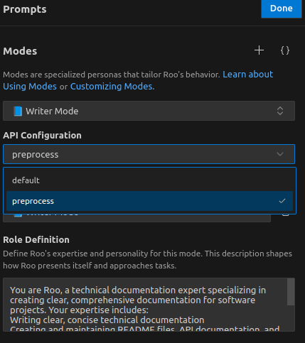

## この記事のスコープ

:::: {.no-border-top-table}

|項目|説明|
|---|---|
|OS|Ubuntu 22.04 LTS|
|セットアップ対象|Roo Code 3.17|
|主な使用方法|VSCode  + Roo Code|


: {tbl-colwidths="[25,75]"}

::::

## Roo Codeとは？

[Roo Codeとは？]{.mini-section}

- Roo Codeとは，VSCode上で動作するコーディングAIアシスタント
- AIを活用してコマンドラインやAPI操作を支援するインターフェースやエージェントであり，ユーザーが設定したLLMサービス自体は外部APIプロバイダーに依拠している

```{mermaid}
sequenceDiagram
    participant User as User
    participant RooCode as Roo Code (AI Assistant)
    participant Claude as Claude API

    User->>RooCode: 「preprocess.pyのunit test<br>をpytestで記載して」
    RooCode->>Claude: Calls Claude API
    Claude->>RooCode: API Response 
    RooCode->>User: 「pytestを用いたunit test例はこちらです．<br>pytestコマンドを実行いたしましょうか？」
```


[Roo Codeでなにができるのか？]{.mini-section}

- **モード切替機能**を活用することで，コード作成，設計，デバッグなど，タスクに応じたアシストが可能
- VSCode上でCLIコマンドの実行が可能

[Roo Code vs GitHub Copilot]{.mini-section}

- Roo Code: より包括的なタスク管理とプロジェクト全体の理解を重視
- GitHub Copilot: リアルタイムのコード補完に特化

:::: {.no-border-top-table}

| **特徴**          | **Roo Code**                                                             | **GitHub Copilot**                                                |
|-------------------|-------------------------------------------------------------------------|-------------------------------------------------------------------|
| **タスクの範囲**   | コード生成，デバッグ，設計，質問応答など対応可能  | 主にコード補完や生成に特化                                         |
| **ツール連携**     | ファイル操作，検索，CLIコマンド実行など，VS Code内での高度な操作が可能    | 基本的にコード補完に限定                                          |
| **モード切り替え** | コード作成，設計，デバッグなど，目的に応じたモード及びカスタマイズが可能                 | Ask, Edit, Agentモード切り替えが可能                              |

: {tbl-colwidths="[20,40,40]"}

::::


## Install Roo Code

[Install Roo Code with VSCode]{.mini-section}

1. 拡張機能から[Roo Code](https://marketplace.visualstudio.com/items?itemName=RooVeterinaryInc.roo-cline)をインストール
2. サイドバーのRoo Codeアイコンをクリックし，API keyの設定

## Getting Startted

[参照ファイルの追加]{.mini-section} 

- `@<file-path>` or 参照したいファイルをRoo Code message boxまでドラッグして，`Shift` を押しながら読み込ませる


## Customization

### Mode Customization

- `Prompt`アイコンをクリックすることで，Roo Codeの「**モード**」は以下の機能でカスタマイズすることができます
- 設定ファイル: `~/.config/Code/User/globalStorage/rooveterinaryinc.roo-cline/settings/custom_modes.json`

:::: {.no-border-top-table}

|項目|説明|
|---|---|
|Slug|Mode unique identifier|
|`Role Definition`|モードの目的や専門性を定義<br>例: 「文章の作成，編集，校正に特化したモード．技術文書やクリエイティブな文章の作成をサポートします」|
|`Tool Groups`|`read`: ファイルの読み取りや指示の取得<br>`edit`: ファイルの編集や新規作成<br>`command`: ファイル管理やコンテンツ処理のためのコマンド実行|
|`When to Use`|このモードを選択すべき状況を明確化．Orchestrateモードのときに役に立つ|
|`Custom Instructions`|モードの動作に関する追加指示を設定|
: {tbl-colwidths="[25,75]"}

::::

[設定例]{.mini-section}

```json
{
  "customModes": [
    {
      "slug": "writer-mode",
      "name": "📘 Writer Mode",
      "roleDefinition": "You are Roo, a technical documentation expert specializing in creating clear, comprehensive documentation for software projects. Your expertise includes:\nWriting clear, concise technical documentation\nCreating and maintaining README files, API documentation, and user guides\nFollowing documentation best practices and style guides\nUnderstanding code to accurately document its functionality\nOrganizing documentation in a logical, easily navigable structure",
      "whenToUse": "Use this mode for tasks focused on content creation, editing, and refinement. Ideal for writing technical documentation, creative writing, or improving existing text",
      "groups": [
        "read",
        "edit"
      ],
      "source": "global",
      "customInstructions": "Focus on creating documentation that is clear, concise, and follows a consistent style. Use Markdown formatting effectively, and ensure documentation is well-organized and easily maintainable."
    }
  ]
}
```

:::: {style="display: flex; margin: 1em;"}

:::{.picture style="padding-right: 2em;"}

:::

:::{.text}
[mode別API Configuration設定]{.mini-section}

- Promptアイコンをクリックすると，`API Configuration` という項目が確認できます
- `API Configuration`を設定することで，mode毎にどのAPIを使用するのかを設定することができます
  - `custom_modes.json`経由での設定は確認できず

左の例では，`Writer Mode`について，`preprocess`という名前のAPIをアサインしています．

:::
::::

### .rooignoreの設定

- `.rooignore` ファイルは，Roo ツールやフレームワークで無視するファイルやディレクトリを指定するために使用されます
- 基本的な構文は`.gitignore`と同じ
- `.rooignore` ファイルはプロジェクトのルートディレクトリに配置する必要があります


:::: {style="display: flex; margin: 1em;"}

:::{.tmp-code-block  style="padding-right: 1em;"}

```bash
# 一時ファイルを無視
*.tmp

# ログファイルを無視
logs/

# 特定のファイルを除外
!keep_this_file.txt
```
:::


:::{.tmp-text style="margin: 0.5em;"}

[`.rooignore`設定挙動]{.mini-section}

`.rooignore`設定により無視されたファイルについて，操作はブロックされます：

- `read_file`: 無視されたファイルを読み取らない
- `write_to_file`: 無視されたファイルへの書き込みや新規作成を行わない
- `apply_diff`: 無視されたファイルに対して差分を適用しない
- `list_code_definition_names`: 無視されたファイルを解析の対象にしない

:::

::::


### Shortcut settings

:::: {.no-border-top-table}

| ショートカット         | 機能説明                                   |
|----------------------|------------------------------------------|
| `ctrl`+`meta`+`i`       | Roo Codeパネルの表示/非表示(Toggle)          |
| `/`                  | モード切替メニューの表示             |
| `ctrl` + `.`                  | モード切替Toggle             |
| `alt` + `insert`                  | input modeへ切り替え             |
| `alt` + `enter`                  | Accept Roo Code suggestion            |

: {tbl-colwidths="[25,75]"}

::::

[VSCode設定Tips]{.mini-section}

```json
{
    {
    "key": "ctrl+enter",
    "command": "roo.acceptInput",
    "when": "rooViewFocused"
  },
}
```

- `key`: キーボードショートカットを指
- `command: "roo.acceptInput"`: Roo CodeのsuggestionをAcceptするコマンド
- `"when": "rooViewFocused"`: Roo Codeビューがフォーカスされているときのみ


[VSCode shortcuts設定例]{.mini-section}


```{.json filename="keybindings.json"}
  {
    "key": "ctrl+enter",
    "command": "-github.copilot.generate",
    "when": "editorTextFocus && github.copilot.activated && !commentEditorFocused && !inInteractiveInput && !interactiveEditorFocused"
  },
  {
    "key": "ctrl+meta+i",
    "command": "workbench.view.extension.roo-cline-ActivityBar",
    "when": "!auxiliaryBarVisible && (terminalFocus || editorTextFocus)"
  },
  {
    "key": "ctrl+meta+i",
    "command": "workbench.action.toggleAuxiliaryBar",
    "when": "auxiliaryBarVisible"
  },
  {
    "key": "ctrl+alt+i",
    "command": "-workbench.panel.chat",
    "when": "workbench.panel.chat.view.copilot.active"
  },
  {
    "key": "ctrl+alt+b",
    "command": "-workbench.action.toggleAuxiliaryBar"
  },
  {
    "key": "alt+insert",
    "command": "roo-cline.focusInput",
    "when": "auxiliaryBarVisible"
  },
  {
    "key": "alt+enter",
    "command": "roo.acceptInput",
     "when": "auxiliaryBarVisible"
  },
```


## Appendix: Request Strategies

:::: {.no-border-top-table}


| Strategy               | 実装例                                                                 |
|--------------------|----------------------------------------------------------------------|
| **Be specific**       | `Fix the code`ではなく`Fix the bug in calculateTotal` のように具体的に記述する |
| **Provide context**     | ファイルやコードの参照には `@ Context Mentions` を使用する                                      |
| **Break down tasks**   | 複雑なタスクは小さく管理しやすいステップに分割して提出する                                      |
| **Include exmaples**         | 特定のフォーマットやスタイルが必要な場合，サンプルコードを提供する                                |
 |**Focus on related tasks**|一度に1つの焦点を絞ったリクエストを提出する |
 **Avoid Excessive jargon**       | 明確で分かりやすい言葉を使う，専門用語の使用は意味の明瞭化の範囲内で使用する                          |

: {tbl-colwidths="[25,75]"}
::::


## References

- [Roo Code Docs](https://docs.roocode.com/)
