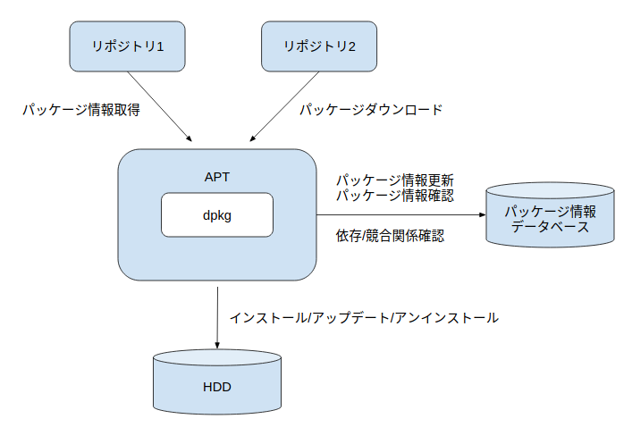

::: {.callout}

この記事は [Ryo's Tech Blog > Linux環境構築基礎知識：パッケージマネジャーの導入](https://ryonakagami.github.io/2020/12/20/packages-manager-apt-command/) の修正版です．

:::

## パッケージとは？

::: {#def- .custom_problem .blog-custom-border}
[Package]{.def-title}

Linuxでは「パッケージ」という単位でソフトウェアを管理する．パッケージとは，インストールに必要なファイル（バイナリ・ライブラリ・設定ファイル・ドキュメント・メタ情報）を一つにまとめたアーカイブのこと．

:::

パッケージの中身は概ね以下の４種類のファイルで構成されます．

```{mermaid}
classDiagram
direction LR
namespace Package {
    class Program {
      ソースコードやそれをコンパイル
      したバイナリ形式のファイル
      （例） /usr/bin/vim, /usr/bin/ls
    }

    class Library {
      よく使用されるプログラムの共通
      部分を抜き出し, 他のプログラム
      からも利用できるようにしたもの
    }

    class Config {
      プログラムが動作するための設定
      値を格納したファイル
      （例） config.yamlなど
    }

    class Document {
      パッケージのメタ情報や依存関係を
      記載したファイルやマニュアル
      （例） README.md
    }
}
```

代表的なパッケージ形式は以下の２つがあります．

:::: {.no-border-top-table}

| 形式       | 拡張子    | 採用ディストリビューション例                       | パッケージ管理コマンド例           |
| -------- | ------ | ---------------------------------- | ----------------------- |
| Debian形式 | `.deb` | Debian GNU/Linux, Ubuntu           | `dpkg`, `apt`, `apt-get` |
| RPM形式    | `.rpm` | Red Hat Enterprise Linux, Fedora, CentOS | `rpm`, `yum`, `dnf`     |
: {tbl-colwidths="[18,12,42,28]"}

::::

[Debian形式パッケージの構成要素]{.mini-section}

`.deb` パッケージはアーカイブとして `ar` コマンドで展開可能であり，Ubuntu用の Zoom パッケージを例にとると以下４ファイルから構成されます．

```zsh
% ar t zoom_amd64.deb
debian-binary
control.tar.xz
data.tar.xz
_gpgbuilder
```

:::: {.no-border-top-table}

| ファイル名           | 内容                                                              |
| --------------- | --------------------------------------------------------------- |
| `debian-binary` | パッケージフォーマットのバージョンを記載したテキストファイル                                  |
| `control.tar.xz` | パッケージ名・バージョン等のメタ情報，依存関係，インストール前後に実行されるスクリプト                     |
| `data.tar.xz`   | 実際にインストールされる実行ファイル・ライブラリ・ドキュメント等                                |
| `_gpgbuilder`   | GPG鍵を用いたパッケージ署名（配布元検証用）                                          |
: {tbl-colwidths="[28,72]"}

::::

::: {.callout-tip}

- Debian形式パッケージは `ar`, `tar`, `xz` といった古典的UNIXコマンドだけで展開できるよう設計されています
- `dpkg` や `apt` を誤って削除してしまっても，パッケージ自体の展開は可能

:::


## パッケージマネジャーとは？

::: {#def- .custom_problem .blog-custom-border}
[Package Manager]{.def-title}

パッケージファイルを用いてシステム上のパッケージに対して

- 更新情報の検索
- インストール
- 依存関係の解決
- 設定管理
- アンインストール

といった一連の管理機能を提供するツール．

:::

任意のソフトウェアを手作業でインストールする場合，本来は以下のような工程が必要となります．

```{mermaid}
---
title: Package Installation Flow
---
classDiagram
  direction LR

%%--- Entityの定義

    class download{
        任意のディレクトリ
        にパッケージ
        ファイルを保存
    }


    class extract{
        指定した場所に
        ファイルを展開
        \n
    }

    class interpret{
    readmeを読んで, 必要な
    コンポーネントやバイナリ,
    コンパイラの一覧を把握
    }

    class build{
    configスクリプト,
    Makefileを読み込み,
    依存関係に留意した上でbuild
    }

    class install{
      Buildしたコード群を
      適切な場所に配置し,
      実行 & エラー対処
    }

%%--- Entity Relationの定義

download --> extract
extract --> interpret
interpret --> build
build --> install
```

パッケージマネジャーはこれらをユーザーが意識することなく自動的に処理してくれます．

主要なLinuxディストリビューションのパッケージ管理ツールは以下：

:::: {.no-border-top-table}

| 系統      | パッケージ管理ツール                  |
| ------- | --------------------------- |
| Red Hat系 | `rpm`（低レベル），`yum` / `dnf`（高レベル） |
| Debian系  | `dpkg`（低レベル），`apt`（高レベル） |
: {tbl-colwidths="[20,80]"}

::::

### 依存関係

::: {#def- .custom_problem .blog-custom-border}
[依存関係 (Dependencies)]{.def-title}

あるアプリケーション $A$ のコマンドを実行するために，別のアプリケーション $B$ のファイルが必要となるとき，$A$ は $B$ に依存しているという．

:::

例として，音声合成ソフトの `festival` は `alsa-utils` に依存しており，`festival` を機能させるためには依存パッケージも合わせてインストールする必要があります．

`apt-cache show` で `gzip` パッケージの依存情報を確認してみます．

```zsh
% apt-cache show gzip
Package: gzip
Architecture: amd64
Version: 1.10-0ubuntu4
Priority: required
Essential: yes
...
Pre-Depends: libc6 (>= 2.17)
Depends: dpkg (>= 1.15.4) | install-info
Suggests: less
...
```

[依存記述で使用される演算子]{.mini-section}

:::: {.no-border-top-table}

| 演算子   | 意味                              |
| ----- | ------------------------------- |
| `<<`  | より低い（未満）                        |
| `<=`  | 以下                              |
| `=`   | 等しい（`2.6.1` は `2.6.1-1` と等しくない） |
| `>=`  | 以上                              |
| `>>`  | より高い                            |
| `,`   | 論理積（AND）                        |
| `\|`  | 論理和（OR）                         |
: {tbl-colwidths="[20,80]"}

::::

::: {.callout-note}

`Pre-Depends` は `Depends` よりも強い依存関係を示し，対象パッケージのインストール前に必ず満たされていなければなりません．

:::


## APT: Advanced Packaging Tool

::: {#def- .custom_problem .blog-custom-border}
[APT]{.def-title}

APT (Advanced Packaging Tool) は Debian系ディストリビューションで使われるパッケージ管理システム．あらかじめ設定されたリポジトリからパッケージとパッケージ情報を取得し，依存関係を自動的に解決しながらインストール・アップグレード・削除を行う．

:::




::: {.callout-note}
### レポジトリ

- レポジトリとは，ファイルやデータを集積している場所，及びその情報を管理しているデータベース
- 単なるファイル置き場というよりかは，「パッケージ本体＋メタデータ」をセットで提供する配布基盤
- 後述するが，`/etc/apt/sources.list` でレポジトリ情報を管理している

:::


[`apt` vs `dpkg`]{.mini-section}


`dpkg` と `apt` は次のように役割が分かれています．

:::: {.no-border-top-table}

| コマンド  | レベル        | 役割                                  |
| ----- | ---------- | ----------------------------------- |
| `dpkg` | 低レベル | パッケージのインストール・削除のみ．依存関係の問題はエラー表示するだけ |
| `apt`  | 高レベル | 依存関係を解決しながらインストール．内部では `dpkg` を呼び出す |
: {tbl-colwidths="[20,20,60]"}

::::

### `apt` コマンドの基本構文

[Basic Syntax]{.mini-section}

```bash
apt [option] subcommand
```

[主なオプション]{.mini-section}

:::: {.no-border-top-table}

| オプション                       | 説明                                       |
| --------------------------- | ---------------------------------------- |
| `-c <設定ファイル>`               | 設定ファイルを指定する（デフォルトは `/etc/apt/sources.list`） |
| `-d`                        | パッケージのダウンロードのみ行う                         |
| `-y`                        | 問い合わせに対して自動的に yes と回答                    |
| `--no-install-recommends`   | 推奨パッケージはインストールしない                        |
| `--install-suggests`        | 提案パッケージもインストールする                         |
| `--reinstall`               | インストール済みパッケージの再インストールを許可                 |
: {tbl-colwidths="[35,65]"}

::::

[主なサブコマンド]{.mini-section}

:::: {.no-border-top-table}

| サブコマンド                       | 説明                                       |
| ---------------------------- | ---------------------------------------- |
| `update`                     | パッケージリストを更新                              |
| `search <keyword>`           | 正規表現でパッケージの説明文を検索                        |
| `install <package>`          | パッケージをインストール                             |
| `remove <package>`           | パッケージを削除（設定ファイルは残る）                      |
| `purge <package>`            | パッケージと設定ファイルを削除（依存パッケージは残る）              |
| `upgrade`                    | インストール済みパッケージを新しいバージョンへアップグレード           |
| `show <package>`             | 指定したパッケージの情報を表示                          |
| `list`                       | パッケージリストを表示                              |
| `list --installed`           | インストール済みパッケージの一覧                         |
| `list --upgradable`          | アップグレード可能なパッケージの一覧                       |
| `depends <package>`          | パッケージの依存関係を表示                            |
| `autoremove`                 | 不要となった依存パッケージを削除                         |
: {tbl-colwidths="[30,70]"}

::::

::: {.callout-warning}

パッケージの説明文ではなくファイル名で検索したい場合は `apt-file` または `dpkg -S` を使うこと．

:::

### パッケージ情報の取得

リポジトリにあるパッケージであれば，インストールの有無に関わらず `apt show` で情報を表示できます．

```zsh
% apt show code
Package: code
Version: 1.52.1-1608136922
Priority: optional
Section: devel
Maintainer: Microsoft Corporation <vscode-linux@microsoft.com>
Installed-Size: 273 MB
Provides: visual-studio-code
Depends: libnss3 (>= 2:3.26), gnupg, apt, libxkbfile1, libsecret-1-0, libgtk-3-0 (>= 3.10.0), libxss1, libgbm1
Conflicts: visual-studio-code
Replaces: visual-studio-code
Homepage: https://code.visualstudio.com/
APT-Sources: https://packages.microsoft.com/repos/code stable/main amd64 Packages
...
```

`Provides` / `Conflicts` / `Replaces` を同一バーチャルパッケージに対し同時宣言することで，そのバーチャルパッケージを提供する実パッケージのうち確実に一つだけがインストールされる状態を保証することができます．

依存関係のみを確認したい場合は `apt depends` を使います．

```zsh
% apt depends code
code
  Depends: libnss3 (>= 2:3.26)
  Depends: gnupg
  Depends: apt
  Depends: libxkbfile1
  Depends: libsecret-1-0
  Depends: libgtk-3-0 (>= 3.10.0)
  Depends: libxss1
  Depends: libgbm1
  Conflicts: <visual-studio-code>
  Replaces: <visual-studio-code>
    code
```

部分一致でリポジトリ上のパッケージを検索したい場合は `apt search` を使用：

```bash
sudo apt search <keyword>
```

### `apt install --reinstall` の使用用途

パッケージをインストールしたあとで重要な構成ファイルを誤って削除してしまった場合，システム上はすでにインストール済みと認識されているため，通常の `install` では上書きインストールができません．このようなときに `--reinstall` オプションが有効です．

```bash
sudo apt install --reinstall postfix
```

### 不要になったパッケージの削除

`man apt` を確認すると，パッケージ削除に関する記述として以下があります．

```text
install, reinstall, remove, purge (apt-get(8))
       Removing a package removes all packaged data, but leaves usually small
       (modified) user configuration files behind, in case the remove was an
       accident. Just issuing an installation request for the accidentally
       removed package will restore its function as before in that case. On the
       other hand you can get rid of these leftovers by calling purge even on
       already removed packages. Note that this does not affect any data or
       configuration stored in your home directory.
```

サブコマンドの使い分けは以下：

:::: {.no-border-top-table}

| サブコマンド       | 動作                                       |
| ------------ | ---------------------------------------- |
| `remove`     | パッケージ本体を削除．ユーザー設定ファイルは残る                 |
| `purge`      | 設定ファイルも含めて削除．ただし依存関係上不要となったパッケージは残る      |
| `autoremove` | 他のパッケージの依存対象でなくなり，かつ自動でインストールされたパッケージを削除 |
: {tbl-colwidths="[20,80]"}

::::

::: {.callout-warning}

- `autoremove` は，依存関係上の参照がなくなったパッケージを一括削除するため，現役で使用しているパッケージまで削除されてしまうケースがあります
- 実行前に `--just-print`（または `--dry-run`，`-s`）でDry Runすることを推奨

:::

[Autoremoveの実行結果を事前に確認]{.mini-section}

```zsh
% apt autoremove --just-print
NOTE: This is only a simulation!
      apt needs root privileges for real execution.
      Keep also in mind that locking is deactivated,
      so don't depend on the relevance to the real current situation!
Reading package lists... Done
Building dependency tree
Reading state information... Done
The following packages will be REMOVED:
  libevent-core-2.1-7 libevent-pthreads-2.1-7 libopts25 sntp
0 upgraded, 0 newly installed, 4 to remove and 67 not upgraded.
Remv sntp [1:4.2.8p12+dfsg-3ubuntu4.20.04.1]
Remv libevent-pthreads-2.1-7 [2.1.11-stable-1]
Remv libevent-core-2.1-7 [2.1.11-stable-1]
Remv libopts25 [1:5.18.16-3]
```

依存対象としてインストールされたが現在では明示的に使用しているパッケージは，`apt-mark manual <package>` で「手動インストール」扱いに変更しておくことで，`autoremove` の対象から外すことができます．

### パッケージがインストールしたファイル群を確認する

パッケージがインストールしたファイル一覧の確認は，「低レベル」パッケージマネジャーである `dpkg` の担当領域です．

```zsh
% dpkg -L vim
/.
/usr
/usr/bin
/usr/bin/vim.basic
/usr/share
/usr/share/bug
/usr/share/bug/vim
/usr/share/bug/vim/presubj
/usr/share/bug/vim/script
/usr/share/doc
/usr/share/doc/vim
/usr/share/doc/vim/NEWS.Debian.gz
/usr/share/doc/vim/changelog.Debian.gz
/usr/share/doc/vim/copyright
...
```

逆に，あるファイルがどのパッケージから提供されているかを調べるには `dpkg -S` を用います．

```zsh
% dpkg -S /usr/bin/vim.basic
vim: /usr/bin/vim.basic
```


## リポジトリの設定

::: {.callout}

`apt update` で最新のパッケージ情報を取得し `apt install` でインストールできるが，パッケージの保管場所（リポジトリ）の情報はどこで管理されているか？

:::

Debian系では，リポジトリ情報は以下の２箇所で管理されています．

:::: {.no-border-top-table}

| 配置                          | 用途                                       |
| --------------------------- | ---------------------------------------- |
| `/etc/apt/sources.list`     | Ubuntu公式リポジトリ情報を記述                          |
| `/etc/apt/sources.list.d/*.list` | サードパーティ製・PPAなどの追加リポジトリ情報を `.list` ファイルとして配置 |
: {tbl-colwidths="[42,58]"}

::::

### `sources.list` のフォーマット

::: {.callout-note}
### `/etc/apt/sources.list` の記述ルール

```text
<パッケージの種類> <取得先URI> <Ubuntu version=suite> <component>
```

:::

::: {#exm- .custom_problem }

```bash
$ cat /etc/apt/sources.list | head -10
# deb cdrom:[Ubuntu 22.04.2 LTS _Jammy Jellyfish_ - Release amd64 (20230223)]/ jammy main restricted

# See http://help.ubuntu.com/community/UpgradeNotes for how to upgrade to
# newer versions of the distribution.
deb http://jp.archive.ubuntu.com/ubuntu/ noble main restricted
# deb-src http://jp.archive.ubuntu.com/ubuntu/ jammy main restricted

## Major bug fix updates produced after the final release of the
## distribution.
deb http://jp.archive.ubuntu.com/ubuntu/ noble-updates main restricted

```


:::
***


[パッケージの種類]{.mini-section}

:::: {.no-border-top-table}

| 種類        | 説明                |
| --------- | ----------------- |
| `deb`     | バイナリパッケージを取得      |
| `deb-src` | ソースパッケージを取得       |
: {tbl-colwidths="[25,75]"}

::::

[component]{.mini-section}

:::: {.no-border-top-table}

| component    | 説明                                       |
| ------------ | ---------------------------------------- |
| `main`       | Canonicalがサポートするフリーなオープンソースソフトウェア        |
| `restricted` | プロプライエタリなソフトウェア（主にデバイスドライバー）             |
| `universe`   | コミュニティによってメンテナンスされるフリーなオープンソースソフトウェア     |
| `multiverse` | 著作権・法的問題によって利用が制限されるソフトウェア                |
: {tbl-colwidths="[20,80]"}

::::

[実例]{.mini-section}

```zsh
% cat /etc/apt/sources.list
# deb cdrom:[Ubuntu 22.04.2 LTS _Jammy Jellyfish_ - Release amd64 (20230223)]/ jammy main restricted

# See http://help.ubuntu.com/community/UpgradeNotes for how to upgrade to
# newer versions of the distribution.
deb http://jp.archive.ubuntu.com/ubuntu/ jammy main restricted
...
```

このラインの意味するところは

- `http://jp.archive.ubuntu.com/ubuntu/` から `deb` パッケージを取得
- Ubuntuディストリビューションは `jammy` (22.04 LTS)
- 取得対象のコンポーネントは `main` と `restricted`


References
--------
- [Ryo's Tech Blog > Linux環境構築基礎知識：パッケージマネジャーの導入](https://ryonakagami.github.io/2020/12/20/packages-manager-apt-command/)
- [APT公式ウェブサイト](https://tracker.debian.org/pkg/apt)
- [Debianパッケージ管理](https://www.debian.org/doc/manuals/debian-reference/ch02.ja.html)
- [Debian 管理者ハンドブック](https://debian-handbook.info/browse/ja-JP/stable/index.html)
- [Launchpad](https://launchpad.net/)
