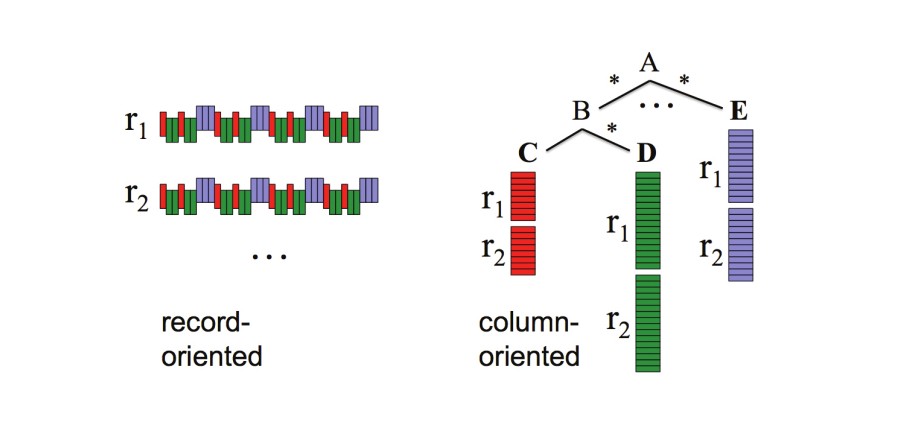

::: {#def- .custom_problem .blog-custom-border}
[Columnar Storage]{.def-title}

- 1つのレコードをcolumn valuesグループ毎に分割し，それぞれを異なるストレージ領域に格納する技術
- 従来のデータベースは通常，レコード全体を1つのストレージ領域に格納する



:::

[Columnar Storageの特徴]{.mini-section}

::: {.callout-note icon="false"}
### 1: 通信量の最小化

- クエリ実行時に，必要な列の値だけがスキャンされ，転送される
- `SELECT title FROM foo`は，`title` 列の値だけにアクセスする
- `SELECT * FROM foo` だと結局ずべてのストーレージ領域に対してアクセスしてしまい，columnar-storageのメリットが活かせなくなる

:::

::: {.callout-note icon="false"}
### 2: 高い圧縮率

- 従来のrow-based storageはおおよそ 1:3 の圧縮に対して，Column storageは 1:10 の圧縮率を達成できるとされる(see [here](http://cs-www.cs.yale.edu/homes/dna/talks/Column_Store_Tutorial_VLDB09.pdf))
- Columnには似通った値が並ぶため傾向があるため（特に列のcardinalityが低い場合），row-based storageよりも高い圧縮率を得やすい

:::

::: {.callout-important icon="false"}
### 3: 更新処理の非効率性

- 既存レコードの更新に弱く，1つのレコードを更新する場合でも列ごとに分割して保存されているため，複数のストレージ領域へアクセスする必要がある
- row-based storageだとrowが１つのストレージ領域へ保存されるので，更新時のアクセスは１つのストレージ領域で済む

:::

::: {#exm- .custom_problem }
[columnar storage vs row-based storage]{.def-title}

```ini
SNO  PRICE CITY    SNAME
---  ------ ----    -----
S1       20 London  Smith
S2       10 Paris   Jones
S3       30 Paris   Blake
S4       20 London  Clark
S5       30 Athens  Adams
```

というような `FOO` テーブルを考えます．シンプルなColumnar storageの場合，以下のように`;`で区切られたグループ毎にストーレージ領域に保存します

```ini
S1S2S3S4S5;2010302030;LondonParisParisLondonAthens;SmithJonesBlakeClarkAdams 
```

一方，row-based storageの場合

```ini
S120LondonSmith;S210ParisJones;S330ParisBlake;S420LondonClark;S530AthensAdams
```

それぞれのstorageパターンに対して

```sql
SELECT CITY, SUM(PRICE) 
FROM FOO 
GROUP BY CITY;
```

というクエリを実行すると

- Row-based storage: 全列(=不要列（SNO, SNAME）もI/O)を毎回読み込んでから，PRICE と CITY を抽出して集計
- Columnar storage: 必要な列だけ読み込む．集計系クエリで圧倒的に速い


:::
***

::: {#exm- .custom_problem }
[row-based storageの方が効率が良い場合]{.def-title}

次のようなSELECT文ではrow-based storageの方が効率的な可能性があります

```sql
SELECT *
FROM SomeTable
WHERE col_1 = 'A';
```

`col_a = 'A'` の条件によってレコード数を大きく絞り込めたとしても，columnar storageの場合は結局 `SELECT *` によってすべての列にアクセスする必要があります．
`col_1` がインデックスを持つ場合だと，インデックス探索で `col_1 = 'A'` の行位置を即座に特定してから必要なストーレージ領域のみ読み込めば良いので，効率的なスキャンが期待できます．


:::
***


Rerferences
-----------
- [Column-Oriented Database Systems, Stavros Harizopoulos, Daniel Abadi, Peter Boncz, VLDB 2009 Tutorial](http://cs-www.cs.yale.edu/homes/dna/talks/Column_Store_Tutorial_VLDB09.pdf)
