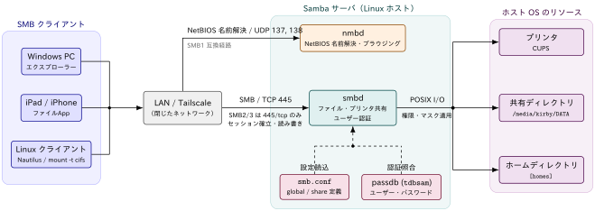

## Sambaでできること

::: {#def- .custom_problem .blog-custom-border}
[Samba]{.def-title}

- LinuxホストをMicrosoftネットワークに参加できるようにするSMBプロとコロルを用いたソフトウェア
- SMB = Server Message Block
- SMB2/3プロトコルは445/tcpのみを使用

:::

[実現できること]{.mini-section}

:::: {.no-border-top-table}

| カテゴリ                  | 機能               | 説明                                                         |
| -------------------------| ---------------- | ---------------------------------------------------------- |
| **ファイル共有**          | ディレクトリ共有         | Windows から Linux/Unix のディレクトリにアクセス可能．読み取り専用／書き込み可の権限設定が可能・ |
|                         | ファイルアクセス制御       | ユーザー・グループごとのアクセス権を設定可能．                                    |
| **プリンタ共有**          | プリンタ共有           | Linux/Unix に接続されたプリンタを Windows から利用可能．          |
|                         | プリンタドライバーの配布         | Samba サーバに Windows 用プリンタドライバーを置いておくと，クライアント側で共有プリンタに接続するだけで自動インストールできる                                     |
| **ホームディレクトリ提供** | ユーザーごとのホームディレクトリ | Windows ユーザーごとに自動マウント可能．                                   |
| **アクセスログ・監査**    | ログ取得             | どのユーザーがいつアクセスしたかのログを取得可能．監査やセキュリティ対策に活用可能．                 |
: {tbl-colwidths="[25,25,50]"}

::::

[Sambaの仕組み]{.mini-section}

Sambaは，SMBプロトコルを話す `smbd` と，NetBIOS名前解決を担う `nmbd` の2つのデーモンでLinuxホストをファイルサーバー化します．
クライアントからの要求は `smb.conf` の共有定義とpassdbの認証情報に照らして検証され，
通過したものだけがホストOSのディレクトリ・プリンタへのPOSIX I/Oに変換されます．

{#fig-samba-architecture width="100%"}

::: {.callout-note icon="false"}

- [`smbd`]{.regmonkey-bold}: 445/tcp で待ち受け，認証・共有アクセスの実務をすべて担当する．Sambaの中核
- [`nmbd`]{.regmonkey-bold}: 137,138/udp を用いたNetBIOS名前解決とブラウジングを担当．SMB2/3のみの環境やTailscale経由での名前解決が効く環境では必須ではない
- [`smb.conf` / passdb]{.regmonkey-bold}: `smbd` が参照する設定と認証DB．`[Share Definitions]` の変更は共有単位で反映されるが，`[Global Settings]` の変更には再起動が必要
- Sambaユーザーは[Linuxユーザーとは別のパスワードDB]{.regmonkey-bold}(`tdbsam`)で管理されるため，`smbpasswd` での登録が別途必要

:::

[Samba と TCP/IP]{.mini-section}

SMBは[TCP上で動くアプリケーション層のプロトコル]{.regmonkey-bold}で，`smbd` は 445/tcp をlistenするごく普通のTCPサーバーです．
実際に `ss` で待ち受けソケットを確認すると，`smbd` が445番ポートで接続を待っていることがわかります．

```zsh
% sudo ss -tlnp | grep smbd
LISTEN 0      50                         0.0.0.0:445        0.0.0.0:*    users:(("smbd",pid=293976,fd=39))                                                        
LISTEN 0      50                            [::]:445           [::]:*    users:(("smbd",pid=293976,fd=38))                                                        

```

`ss` の各カラムは左から，

- ソケットの状態(`LISTEN`)
- 受信キューの滞留数(`0`)
- バックログの上限(`50`)，
- ローカルのアドレス:ポート
- リモートのアドレス:ポート
- そのソケットを保持しているプロセス

を表示しています．`0.0.0.0:445` と `[::]:445` の2行が出ているのは，同一の `smbd` プロセス(pid=293976)がIPv4用とIPv6用に
別々のソケット(`fd=39` / `fd=38`)を開いているためで，デーモンが2つ起動しているわけではありません．

`0.0.0.0` / `[::]` はワイルドカードアドレスを意味し，[ホストが持つすべてのNIC宛の接続を受け付ける]{.regmonkey-bold}状態を表します．

::: {.callout-note icon="false"}

- [445/tcp (`smbd`)]{.regmonkey-bold}: SMB本体の通信路．ここが開いていなければ共有には一切アクセスできない
- 特定のNICにのみ待ち受けさせたい場合は `[global]` の `interfaces` と `bind interfaces only = yes` を設定する．
  この場合 `0.0.0.0:445` ではなく個別のIPアドレスがlistenアドレスとして表示される

:::


### Sambaユーザー認証

- [`security`]{.regmonkey-bold} : どこで認証するか
- [`passdb backend`]{.regmonkey-bold}: 認証情報をどこに保存するか

の2つのパラメータで，Sambaの認証まわりの挙動はほぼ決まります．どちらも，後述する `[global]` セクションに記述します．

```ini
[global]
   security = user
   passdb backend = tdbsam
```

[`security` の設定値]{.mini-section}

`security` は[クライアントの認証をどこで行うか]{.regmonkey-bold}を指定するパラメータです．
Samba 4以降では `share` (認証なし共有)が廃止され，実質的に `user` / `domain` / `ads` の3択になっています．

:::: {.no-border-top-table}

| 設定値      | 説明                                                                                                          |
| --------- | ------------------------------------------------------------------------------------------------------------- |
| `user`    | [デフォルト値]{.regmonkey-bold}．Samba サーバー自身が持つ認証DB(`passdb backend`)でユーザー名とパスワードを検証する．単体のファイルサーバー(standalone server)ならこれを使う |
| `domain`  | ドメインコントローラーによる認証設定 |
| `ads`     | Active Directory ドメインのメンバーサーバーとして参加し，Kerberos経由でADに認証を委譲する設定 |
| ~~`share`~~ | 共有単位でパスワードを持ち，ユーザー認証を行わない旧方式．[Samba 4.0で廃止済み]{.regmonkey-bold}のため使用不可．匿名共有をしたい場合は `security = user` + `guest ok = yes` で代替する |
: {tbl-colwidths="[20,80]"}

::::

[`passdb backend` の設定値]{.mini-section}

`passdb backend` は，[Sambaユーザーのアカウント情報(ユーザー名・NTハッシュ・SIDなど)をどこに保存するか]{.regmonkey-bold}を指定するパラメータです．
`security = user` のときにこのDBが参照されます．

:::: {.no-border-top-table}

| 設定値       | 説明                                                                                                       |
| ---------- | ----------------------------------------------------------------------------------------------------------- |
| `tdbsam`   | [デフォルト値]{.regmonkey-bold}．TDB(Trivial Database)形式のローカルファイル `/var/lib/samba/private/passdb.tdb` に保存する．設定不要で使え，数百ユーザー規模までのスタンドアロン構成に適する |
| `ldapsam`  | LDAPサーバー(OpenLDAPなど)にアカウント情報を保存する．`ldapsam:ldap://ldap.example.com` のようにURIを付けて指定する．複数のSambaサーバーでアカウントを共有したい場合に使う |
| `smbpasswd`| 旧来のテキストファイル `/etc/samba/smbpasswd` に保存する形式．[非推奨]{.regmonkey-bold}で，SIDやアカウントポリシーなどの情報を保持できない．旧環境からの移行時にのみ登場する |
: {tbl-colwidths="[20,80]"}

::::

::: {.callout-important}
## Sambaユーザーは Linuxユーザーとは別管理

- `passdb backend` に登録されるのは[Sambaのパスワードのみ]{.regmonkey-bold}
- Linuxのパスワード(`/etc/shadow`)とは別物です．
- Sambaユーザーは[同名のLinuxユーザーが存在していること]{.regmonkey-bold}が前提(ファイルの所有権をUIDで管理するため)

したがって新規ユーザーを追加する場合は，Linuxユーザーの作成 → `smbpasswd -a` の順で登録します．

:::{.padding-left-10}

```zsh
# 1. Linuxユーザーを作成 (ログイン不要ならシェルを無効化しておく)
% sudo useradd -M -s /usr/sbin/nologin sambauser

# 2. Sambaの認証DB (passdb backend) に登録
% sudo smbpasswd -a sambauser
New SMB password:
Retype new SMB password:
Added user sambauser.

# 3. 登録済みユーザーの確認
% sudo pdbedit -L -v
```

:::


- `unix password sync = yes` を設定しておくと，Samba側のパスワード変更が `passwd program` を通じてLinux側にも反映される
- ファイル共有用途がメインであるならば特段，必要はないと感じる

:::

## Sambaのインストール

apt経由で `samba` パッケージをインストールします

```zsh
# install
% sudo apt install -y samba

# version check
% samba --version
Version 4.19.5-Ubuntu
```

`samba` は，ファイルサーバー，プリントサーバー，ユーザー管理を担うsmbdデーモン，名前解決を担うnmbdデーモンから構成されます．
ファイヤーウォールを使っている場合は，Sambaを利用できるように次のような設定をします

```zsh
% sudo ufw allow samba
Rule added
Rule added (v6)
```

tailscaleを導入している場合は，tailscaleについてのファイヤーウォールを実施するだけでOKです．

```zsh
% sudo ufw allow in on tailscale0
```

::: {.callout-note}
## Samba運用上の注意

- Samba サーバーは基本的に [LAN 内での運用]{.regmonkey-bold}を前提(=企業や家庭内ネットワークなど，閉じたネットワークでの利用が基本)
- [インターネットサーバー上での動作は推奨されない]{.regmonkey-bold}
- ADが使えるとはいえ，Windows Serverで実現できるすべての機能が実装されているわけではない

:::


[各デーモンに対応する `systemctl` サービス]{.mini-section}

:::: {.no-border-top-table}

| 構成要素                | 担当機能                           | systemctl サービス名 |
| ---------------- | ------------------------------ | --------------- |
| **smbd**            | ファイル共有・プリント共有・ユーザー認証           | `smbd`          |
| **nmbd**            | 名前解決                        | `nmbd`          |
| **samba-ad-dc**     | Samba AD DC サービス（AD ドメインコントローラ運用時） | `samba-ad-dc` |

::::


## Sambaの設定

::: {.callout-note}
### Samba設定の基本

- Sambaの主な設定は `/etc/samba/smb.conf` に記述
- `[セクション名]` で始まるブロックごとにルールを設定していく．セクション名がそのまま**共有名（share name）**になる．クライアントから見えるのはこの名前．
- `/etc/samba/smb.conf` を編集するときは `sudo cp -a smb.conf smb.conf.default` なり `.bak` 拡張子を用いてバックアップをしておくと安全です．

:::

[`smb.conf` Syntax]{.mini-section}

```ini
parameter = value
# commentout line begins with # or ;
```

[予約セクション]{.mini-section}

:::: {.no-border-top-table}

| セクション	| 役割 | 
| ----- | ----------------------- |
| `[global]` | サーバ全体の動作を決める唯一の特別なセクション。ここに書いた値は以降のすべての共有セクションのデフォルト値としても継承される（workgroup、interfaces、server min protocol など）	|
| `[homes]` |	各ユーザーのホームディレクトリの共有に関するパラメータ設定セクション | 
| `[printers]` |	CUPS などのプリンタスプーラと連携し、登録済みプリンタを自動的に共有・公開するための設定セクション．ファイルサーバ用途では不要 |
| `[print$]`|	Windows クライアントに配布するプリンタドライバ設定セクション	プリンタ共有を使わないなら不要|


::::


[`global`の設定項目]{.mini-section}

:::: {.no-border-top-table}

| 項目                     | 説明                                                        | 例                                                                            |
| ---------------------- | -------------------------------------------------------------| ---------------------------------------------------------------------------- |
| `workgroup`            | Windows ネットワーク上のワークグループ名を指定                     | `WORKGROUP`                                                                  |
| `server string`        | サーバーの説明文（ネットワークブラウザに表示される）                  | `Samba Server`                                                               |
| `log file`             | ログファイルの出力場所                                           | `/var/log/samba/log.%m`                                                      |
| `max log size`         | ログファイルの最大サイズ (KB)                                    | `1000`                                                                       |
| `server role`          | サーバーの役割．ファイルサーバーとして使う場合は`standalone server`  | `standalone server` / `member server` / `active directory domain controller` |
| `passdb backend`       |ユーザー認証DBの指定                                             | `tdbsam / ldapsam`                                                           |
| `unix password sync`   |Sambaユーザーアカウントのpassword変更をLinuxユーザーアカウントのpasswordにも反映| `yes` / `no`                                                      |
| `passwd program`       | Samba がパスワード変更要求を受けた際に，実行するコマンドを指定する           | `/usr/bin/passwd %u`                                                          |
| `passwd chat`          | `passwd program` とやり取りする際の「対話プロンプトと応答パターン」を定義する| `*New*password* %n\n *Retype*new*password* %n\n *password*updated*successfully*` |
| `pam password change`  | 有効にすると，password変更に`passwd program` に指定したコマンドではなくPAMを利用する|`yes` / `no`|
: {tbl-colwidths="[25,35,40]"}

::::

[共有セクションの設定項目]{.mini-section}

:::: {.no-border-top-table}

| 項目               | 説明                      | 例                   |
| ---------------- | ----------------------- | ------------------- |
| `path`           | 実際に公開するディレクトリの絶対パス      | `/srv/samba/public` |
| `comment`        | ネットワークブラウザに表示される説明文     | `Public Share`      |
| `browseable`     | ネットワークブラウザに表示するか        | `yes` / `no`        |
| `read only`      | 読み取り専用にするか              | `yes` / `no`        |
| `writable`       | `read only` の逆指定（同義語）   | `yes`               |
| `guest ok`       | 認証なしでアクセスできるか           | `yes` / `no`        |
| `valid users`    | アクセスを許可するユーザー/グループ      | `%S` とすればhome directoryのユーザーのみが自身のhome directoryにアクセスできる     |
| `invalid users`  | アクセスを拒否するユーザー/グループ      | `@nogroup user2`    |
| `create mask`    | 新規ファイル作成時のパーミッションマスク    | `0644`              |
| `directory mask` | 新規ディレクトリ作成時のパーミッションマスク  | `0755`              |
| `public`         | `guest ok` の別名          | `yes` / `no`        |
| `locking`        | ファイルロックの使用有無            | `yes`               |
| `printable`      | プリンタ共有として扱うか            | `no`（通常のフォルダ共有なら）   |
: {tbl-colwidths="[25,35,40]"}

::::

[構文チェック]{.mini-section}

`testparm` コマンドを用いることでconfigファイルの構文チェックをすることができます

```zsh
% testparm -s
Load smb config files from /etc/samba/smb.conf
Loaded services file OK.
...
```
:::: {.no-border-top-table}

| オプション                | 説明                                 | 例 / 補足                                 |
| -------------------- | ---------------------------------- | -------------------------------------- |
| `-s`                 | **短い形式で表示**（冗長な情報を省略し，主要な設定のみを出力）  | `testparm -s`                          |
| `-v`                 | **詳細表示**（全設定，コメントやデフォルト値も含む）       | `testparm -v`                          |

::::

## 共有の作成

iPadからtailscale経由でアクセス可能な共有ディレクトリを指定したいと思います．

```ini
[server-hdd]
   comment = 2TB sized hdd
   path = /media/kirby/DATA/
   browsable = yes
   writable = yes
   guest ok = no
   printable = no
   valid users = dedede kirby
```

と指定すると `server-hdd` を共有名として `path` を公開することができます．設定が完了したら

```zsh
% sudo systemctl restart smbd
```

を実施します．

[iPadからのアクセス設定]{.mini-section}

Tailscaleをつないでいるならば自動的に名前解決してくれます．手順は以下です．

1. Tailscale管理画面から共有設定したサーバーの名前を調べる(例: `dsserver`)
2. `ファイル` から右上の３点マークの設定を開く
3. 「サーバーへ接続」を開き以下の書式で入力する

```ini
smb://dsserver/
```

その後，Sambaユーザー名とSambaパスワード等が要求されますが，それは `smb.conf` の設定に合わせて入力してください．

[only readable errorが出る場合]{.mini-section}

原因としてストーレージのフォーマットにiOSが対応していないことが考えられます．
iOSの標準ファイルシステムサポートは `APFS` / `HFS+` / `FAT32` / `exFAT` に限られ，`NTFS`は基本的には読み取り専用になってしまいます．

マウントしてもread-onlyの場合は，ファイルシステムのフォーマットを確認してみてください．
もし，`NTFS`であるならば中身を退避して，サーバー側でフォーマットを以下のコマンドで書き換えてしまいます

```bash
$ sudo mkfs.exfat -n <任意の名前> /dev/sda1
```

その後，サーバー側で再度以下のコマンドでmountを実施し，sambaの設定をすればOKです

```bash
sudo mount -t exfat -o uid=1000,gid=1000,fmask=000,dmask=000 /dev/sda1 <mount-point-path>
```

::: {.callout-warning}
### exfatの問題点

- モバイルを含む複数のOSでreadable and writableで使用するなら`exFAT` のほうが取り回しは効きます
- 一方，ジャーナル機能やファイル圧縮，暗号化への対応はされていないので，セキュリティ面を重視するならば利用は控えたほうが良いです

:::

### NautilusでSamba共有フォルダをmountする

基本的にはiPadでの設定と同じ手順です

[section]{.mini-section}

Tailscaleをつないでいるならば自動的に名前解決してくれます．手順は以下です．

1. Tailscale管理画面から共有設定したサーバーの名前を調べる(例: `dsserver`)
2. Nautilusを開く
3. `+ Other Locations` をクリックし，以下の書式でconnection設定を行う

```ini
smb://dsserver/
```

その後，Sambaユーザー名とSambaパスワード等が要求されますが，それは `smb.conf` の設定に合わせて入力します．


### クライアント接続情報の確認

Sambaサーバに対するアクセス状況は以下のように確認できます．


```bash
$ sudo smbstatus

Samba version 4.19.5-Ubuntu
PID     Username     Group        Machine                                   Protocol Version  Encryption           Signing              
----------------------------------------------------------------------------------------------------------------------------------------
1018393 kirby        kirby        100.x.x.x (ipv4:100.x.x.x:60008)          SMB3_11           -                    partial(AES-128-GMAC)
1011489 dedede       dedede       100.x.x.x (ipv4:100.x.x.x:40280)          SMB3_11           -                    partial(AES-128-GMAC)
1009585 nobody       nogroup      100.x.x.x (ipv4:100.x.x.x:30585)          SMB3_11           -                    -                    

Service      pid     Machine       Connected at                     Encryption   Signing     
---------------------------------------------------------------------------------------------
IPC$         1009585 100.x.x.x     Wed Sep  9 08:33:26 PM 2026 JST  -            -           
server-hdd   1018393 100.x.x.x     Wed Sep  9 08:47:25 PM 2026 JST  -            -           
server-hdd   1011489 100.x.x.x     Wed Sep  9 08:39:04 PM 2026 JST  -            -           


Locked files:
Pid          User(ID)   DenyMode   Access      R/W        Oplock           SharePath   Name   Time
--------------------------------------------------------------------------------------------------
1011489      1003       DENY_NONE  0x120089    RDONLY     NONE             /media/kirby/DATA/ sambafs/xxxxx/DiNardoetal.pdf   Wed Sep  9 20:52:08 2026

```


::: {.callout-note}
### `IPC$` とは？

- Inter Process Communication の略
- 匿名ユーザーが共有情報を取得するために必要なセクション

:::
