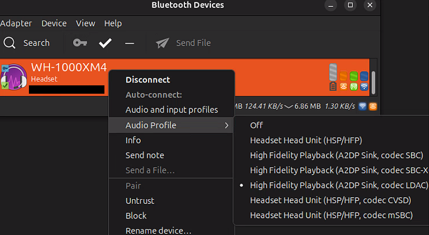
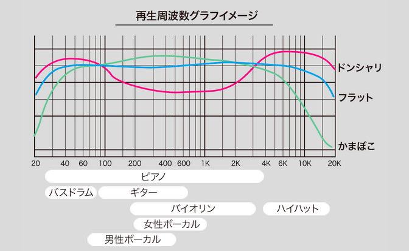
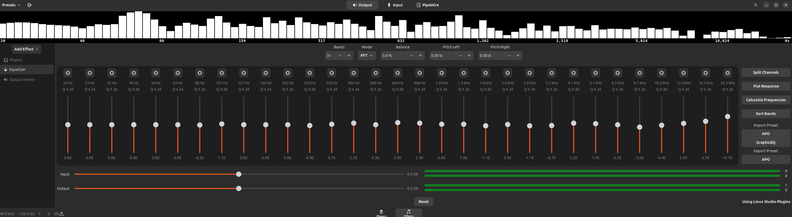
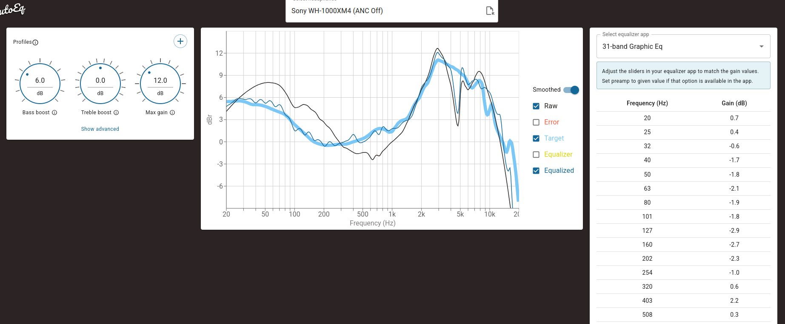

## 🎯 Goals

- Ubuntu 24.04 LTSに対するLDAC利用可能な状態でのWH-1000XM4接続設定
- EasyEffectsを用いたWH-1000XM4用Equalizerの設定

[Package Requirements]{.mini-section}

| カテゴリ               | パッケージ                             | 説明                                         |
| ------------------ | --------------------------------- | ------------------------------------------ |
| **Bluetooth LDAC** | `libldacbt-abr-dev`               | LDAC の ABR (Adaptive Bitrate) ライブラリ（開発用）   |
|                    | `libldacbt-enc-dev`               | LDAC エンコーダライブラリ（開発用）                       |
| **Bluetooth 管理**  | `blueman`                         | Bluetooth デバイス管理用 GUI                      |
| **オーディオ基盤**    | `pipewire`                        | オーディオサーバ（PulseAudio 互換）                 |
|                    | `pipewire-pulse`                  | PulseAudio アプリ互換サーバ                        |
|                    | `wireplumber`                     | PipeWire のsession / policy manager                  |
| **音質補正**        | `easyeffects`                     | 音響補正ツール(Equalizerなど)                    |
: {tbl-colwidths="[25,25,50]"}

今回はPipewire環境での接続設定となります．

## 💻 実行環境

### Ubuntu

[Distribution]{.mini-section}

```bash
% lsb_release -a
No LSB modules are available.
Distributor ID:	Ubuntu
Description:	Ubuntu 24.04.3 LTS
Release:	24.04
Codename:	noble
```

[Linux kernel]{.mini-section}

```bash
% uname -srpo
Linux 6.14.0-29-generic x86_64 GNU/Linux
```

### 🎧 Sony WH-1000XM4のスペック

[ワイヤレス機能]{.mini-section}

| 項目             | 内容                               |
| -------------- | -------------------------------- |
| Bluetoothバージョン | Ver.5.0 / Class 1                |
| 連続再生時間         | 最大30時間（NC ON時） / 最大38時間（NC OFF時） |
| 充電時間           | 約3時間                             |
| 対応コーデック        | SBC / AAC / LDAC                 |
| NFC            | ○                                |
| TWS Plus対応     | ☓                                |
| マルチペアリング対応     | ○                                |
| マルチポイント対応      | ○                                |

[機能]{.mini-section}

| 項目             | 内容                               |
| --------------- | -------------------------------- |
| 重量             | 254g                              |
| ノイズキャンセリング     | ○                                |
| ハイレゾ           | ○                                |
| マイク            | ○                                |
| 外音取り込み         | ○                                |
| 音質調整           | ○                                |
| 防水・防塵性能        | ☓                                |
| リモコン操作           | ○                                |
| 折りたたみ          | ○                                |
| サラウンド          | ☓                                |
| AIアシスタント搭載     | Google アシスタント / Amazon Alexa     |
| AIアシスタント呼び出し機能 | ○                                |

::: {.callout-caution}
### マルチポイント接続の注意点

- WH-1000XM4ではマルチポイント接続設定OnにするとLDACが使用できなくなります
- WH-1000XM5以降ではこの点は改善されています

:::

[LDACとは？]{.mini-section}

LDACとはSony が開発した Bluetoothオーディオコーデックです．Bluetoothのコーデックとは，スマホや音楽再生プレイヤーなどのデバイスからワイヤレスイヤホンやヘッドホンなどに無線で音楽のデータを送る際の符号化の規格です．
圧縮の規格でもあるので元の音楽データを圧縮エンコードしBluetoothで飛ばし，受信デバイスのイヤホンなどでデコードすることで音楽の再生をしています．そのため，コーデックの違いにより，音質や遅延に違いが出ます．

| 特性項目      | 内容                                                   |
| --------- | ---------------------------------------------------- |
| コーデック名    | **LDAC**                                             |
| 特徴        | ハイレゾ対応の最高音質 Bluetooth コーデック（Sony 開発）                 |
| 主な採用機器    | ハイレゾ対応 Android / iOS / Windows / Mac / Linux (PipeWire)    |
| サンプリング周波数 | 最大 **96 kHz**                                        |
| 量子化ビット数   | 最大 **24 bit**                                        |
| ビットレートモード | **330 kbps / 660 kbps / 990 kbps** の 3 段階（ABRで自動調整可） |
| 遅延        | SBC / AAC より大きめ（高音質優先のため）                            |


## 🔨 WH-1000XM4接続設定

```{mermaid}
---
config:
  theme: redux
  themeVariables:
    fontFamily: '"Meiryo"'
    fontSize: 1.1em
    lineHeight: 1.4
---
timeline
    title WH-1000XM4接続設定手順
    section ① Bluetooth 接続確認
        Bluetooth Manager<br>のインストール
            : Blueman<br>のインストール
        LDAC サポート確認
            : LDAC encoding toolのインストール
            : Adaptive bit rate tooのインストール
    section ② Config調整
        Pipewire設定
            : sampling frequencyの設定
        Wireplumber設定
            : LDAC encoding qualityの設定
    section ③ WH-1000MX4動作確認
        Bluetooth ペアリング : Bluemanで WH-1000XM4 を接続
        接続確認
            : 周波数確認
            : Codec確認
            : LDAC bit rate確認

```

[Bluetooth Managerのインストール]{.mini-section}

まずBluetooth デバイス管理ツール Blueman をインストールします．
Ubuntu 24.04 LTSにはデフォルトでBluetooth Managerが入っているので「接続して音を出す」だけならばインストール不要です．

一方，接続プロファイルやcodecの選択といった制御がしやすいので今回導入します．

```{bash}
sudo apt install blueman
```


[LDAC codecの設定]{.mini-section}

Ubuntu 24.04 のデフォルトの Bluetooth ManagerだとLDACは使用できないので，以下のパッケージをインストールします

- `libldacbt-enc-dev`: LDACエンコーディング処理用パッケージ
- `libldacbt-abr-dev`: Adaptive Bit Rateに対応するための開発ライブラリ

`-dev` suffixが無いものでも良いような気がしますが，今後ビルドとかするかもなので大は小を兼ねるとして開発用ライブラリをインストール．
インストールコマンドは以下

```bash
sudo apt install libldacbt-abr-dev libldacbt-enc-dev
```

[Bluetooth接続確認]{.mini-section}

Bluetooth Managerを起動して，WH-1000XM4をペアリング接続します．このとき，LDAC codecを指定するのを忘れずに



次に `pactl list sinks` コマンドを用いて接続状態を確認してみます．

:::: {.no-border-top-table}

| 構成要素              | 説明                                                 |
| ----------------- | -------------------------------------------------- |
| **pactl**         | PulseAudio の制御ツール．サウンドデバイスの状態取得や操作のコマンド．             |
| **list sinks**    | 出力デバイス（`sink`＝スピーカーやBluetoothイヤホンなど）の一覧を表示するサブコマンド  |

::::

Bluetoothデバイスは `Name: bluez` というsink名になります．これらを踏まえて状態を確認してみます

```zsh
% pactl list sinks | grep -A 20 'Name: bluez'
	Name: bluez_output.xx_xx_xx_xx_xx_xx.1
	Description: WH-1000XM4
	Driver: PipeWire
	Sample Specification: float32le 2ch 48000Hz
	Channel Map: front-left,front-right
	Owner Module: 4294967295
	Mute: no
	Volume: front-left: 28382 /  43% / -21.81 dB,   front-right: 28382 /  43% / -21.81 dB
	        balance 0.00
	Base Volume: 65536 / 100% / 0.00 dB
	Monitor Source: bluez_output.xx_xx_xx_xx_xx_xx.1.monitor
	Latency: 0 usec, configured 0 usec
	Flags: HARDWARE HW_VOLUME_CTRL DECIBEL_VOLUME LATENCY 
	Properties:
		api.bluez5.address = "xx:xx:xx:xx:xx:xx"
		api.bluez5.codec = "ldac"
		api.bluez5.profile = "a2dp-sink"
		api.bluez5.transport = ""
		card.profile.device = "1"
		device.id = "179"
		device.routes = "1"
```

ここから，Bluetooth コーデックとサンプリングレートの確認ができます．

以下のようにcodecは問題なくLDACの認識となってます

```ini
  api.bluez5.codec = "ldac"
  api.bluez5.profile = "a2dp-sink"
```

一方，samplking frequencyが

```ini
	Sample Specification: float32le 2ch 48000Hz
```

となっています．LDACは最大96kHz対応できるはずなので，PipeWire のサンプリング周波数を設定します．


[sampling frequencyの設定]{.mini-section}

`/usr/share/pipewire/pipewire.conf` に設定ファイルがあるのでこれを修正します．

- `default.clock.rate`: フォルトのサンプリング周波数(Hz)
- `default.clock.allowed-rates`: PipeWire が切り替えを許可するサンプルレートのリスト

以上2つの項目を修正します．

```ini
default.clock.rate          = 96000
default.clock.allowed-rates = [ 48000, 96000 ]
```

という形に変更します．`/usr/share/pipewire/pipewire.conf` は `root` ownerのファイルなので，修正するときは

```bash
sudo vim /usr/share/pipewire/pipewire.conf
```

で編集します．


```ini
...
context.properties = {
    ## Configure properties in the system.
    #library.name.system                   = support/libspa-support
    #context.data-loop.library.name.system = support/libspa-support
    #support.dbus                          = true
    #link.max-buffers                      = 64
    link.max-buffers                       = 16                       # version < 3 clients can't handle more
    #mem.warn-mlock                        = false
    #mem.allow-mlock                       = true
    #mem.mlock-all                         = false
    #clock.power-of-two-quantum            = true
    #log.level                             = 2
    #cpu.zero.denormals                    = false

    core.daemon = true              # listening for socket connections
    core.name   = pipewire-0        # core name and socket name

    ## Properties for the DSP configuration.
    default.clock.rate          = 96000
    default.clock.allowed-rates = [ 48000, 96000 ]
    default.clock.quantum       = 1024
    default.clock.min-quantum   = 32
    default.clock.max-quantum   = 2048
    default.clock.quantum-limit = 8192
    default.clock.quantum-floor = 4
    #default.video.width         = 640
    #default.video.height        = 480
    #default.video.rate.num      = 25
    #default.video.rate.denom    = 1
    #
    #settings.check-quantum      = false
    #settings.check-rate         = false
    #
    # These overrides are only applied when running in a vm.
    vm.overrides = {
        default.clock.min-quantum = 1024
    }
...
```

編集後にサービスを再起動して設定を読み込ませます．

```bash
systemctl --user restart pipewire pipewire-pulse wireplumber
```

もし接続が安定していればsampling frequencyを確認すると96kHzになっているはずです

```zsh
% pactl list sinks | grep -A 20 'Name: bluez'|grep "Sample Specification:"
	Sample Specification: float32le 2ch 96000Hz
```

ただし，かならず96kHzとはなりません．あくまで最大96kHzであって，接続状態に応じて 48kHz になったります．

[LDAC encoding qualityの設定]{.mini-section}

Bit rateは，動画の1秒あたりのデータ量を示す値です． bps（bits per second）と表記され，1Mbpsに設定されている場合，1秒あたりデータ量が0.125MB（1byte＝8bit）の動画ということになります． 
ビットレートが高い動画ほど，データ量が多く高画質です．

LDACのbit rateを高品質モードで安定させたい場合は，WirePlumber の Bluetooth 設定ファイル `/usr/share/wireplumber/bluetooth.lua.d/50-bluez-config.lua` を編集します．
`bluez5.a2dp.ldac.quality` というフィールドがLDAC のエンコード品質を設定するオプションです．

:::: {.no-border-top-table}

| 値      | 説明                                  | ビットレート         |
| ------ | ----------------------------------- | -------------- |
| `auto` | 適応ビットレート（Adaptive Bitrate），デフォルト | 変動             |
| `hq`   | 高品質モード                              | 990 / 909 kbps |
| `sq`   | 標準品質モード                             | 660 / 606 kbps |
| `mq`   | モバイル用低ビットレートモード                     | 330 / 303 kbps |

::::

`hq` を設定すれば，理論上は最大 96 kHz のサンプルレートをフル品質で利用できるはずです．

```lua
matches = {
      {
        -- Matches all sources.
        { "node.name", "matches", "bluez_input.*" },
      },
      {
        -- Matches all sinks.
        { "node.name", "matches", "bluez_output.*" },
      },
    },
```

上記のセクションで `["bluez5.a2dp.ldac.quality"] = "hq",  -- LDAC HQ モード` という設定をします．このセクションは

- `"bluez_input.*"`: すべての Bluetooth 入力ノード（マイクなど）
- `"bluez_output.*"`: すべての Bluetooth 出力ノード（ヘッドホンなど）

正規表現で上記にマッチするすべてのノードに `apply_properties` を適用するという内容になります．従って，以下のような設定になります

```lua
...
  {
    matches = {
      {
        -- Matches all sources.
        { "node.name", "matches", "bluez_input.*" },
      },
      {
        -- Matches all sinks.
        { "node.name", "matches", "bluez_output.*" },
      },
    },
    apply_properties = {
      --["node.nick"] = "My Node",
      --["priority.driver"] = 100,
      --["priority.session"] = 100,
      --["node.pause-on-idle"] = false,
      --["resample.quality"] = 4,
      --["channelmix.normalize"] = false,
      --["channelmix.mix-lfe"] = false,
      --["session.suspend-timeout-seconds"] = 5,  -- 0 disables suspend
      --["monitor.channel-volumes"] = false,

      -- Media source role, "input" or "playback"
      -- Defaults to "playback", playing stream to speakers
      -- Set to "input" to use as an input for apps
      --["bluez5.media-source-role"] = "input",
      ["bluez5.a2dp.ldac.quality"] = "hq",  -- LDAC HQ モード
    },
  },
...
```

上記実行後再びサービスを再起動しときます．

```bash
systemctl --user restart pipewire pipewire-pulse wireplumber
```

すると以下のような接続状態になるはずです

```zsh
% pactl list sinks | grep -A 20 'Name: bluez'                             
	Name: bluez_output.xx_xx_xx_xx_xx_xx.1
	Description: WH-1000XM4
	Driver: PipeWire
	Sample Specification: float32le 2ch 96000Hz
	Channel Map: front-left,front-right
	Owner Module: 4294967295
	Mute: no
	Volume: front-left: 19609 /  30% / -31.44 dB,   front-right: 19609 /  30% / -31.44 dB
	        balance 0.00
	Base Volume: 65536 / 100% / 0.00 dB
	Monitor Source: bluez_output.xx_xx_xx_xx_xx_xx.1.monitor
	Latency: 0 usec, configured 0 usec
	Flags: HARDWARE HW_VOLUME_CTRL DECIBEL_VOLUME LATENCY 
	Properties:
		allowed-rates = "table: 0xxxxxxxxxxxxx"
		api.bluez5.address = "xx:xx:xx:xx:xx:xx"
		api.bluez5.codec = "ldac"
		api.bluez5.profile = "a2dp-sink"
		api.bluez5.transport = ""
		bluez5.a2dp.ldac.quality = "hq"
		card.profile.device = "1"
```

以上で設定は完了です．

::: {.callout-note}
### 周波数は96kHzの方が本当に良いのか？

48kHzに比べ96kHzは転送可能データ量は倍増しますが，その分Bluetooth 帯域の負荷が高くなります．そのため，音途切れが出やすくなります．
家や障害物の少ない環境なら良いとは思いますが，外出のときに使う場合は96kHzにこだわる必要はないと思います．また，そもそも論としてあくまでLDACは音楽を聞くためのcodecであって，通話とかのときは使えません．

:::


### その他フィールドについて

[Owner Module]{.mini-section}

`Owner Module`は，音源（Sink）や音声ノードを 所有している PipeWire モジュール の IDをしめすフィールドです．

```ini
Owner Module: 4294967295
```

となってますが


$$
4,294,967,295 = 2^{32} - 1
$$

であることから特別な意味がありそうなことが推察できます．実際に，PipeWire / PulseAudio では 「所有者なし」 を表すフラグ的な値として扱われてます．

[PulseAudio / PipeWire における音量の内部表現]{.mini-section}

`Base Volume: 65536 / 100% / 0.00 dB` という行があります．

$$
65,536 = 2^{16}
$$

で音量の最大値を示しています．[PipeWire/pipewire Repository > volume.h source](https://gitlab.freedesktop.org/pipewire/pipewire/-/blob/master/spa/plugins/alsa/acp/volume.h)の実装を確認してみると


```c
typedef uint32_t pa_volume_t;

#define PA_VOLUME_MUTED ((pa_volume_t) 0U)
#define PA_VOLUME_NORM ((pa_volume_t) 0x10000U)
#define PA_VOLUME_MAX ((pa_volume_t) UINT32_MAX/2)
```

となっており，音量は 32bit unsigned intとして扱われてますが，
```c
#define PA_VOLUME_NORM ((pa_volume_t) 0x10000U)
```

で16bit 正規化 (`0x10000`) が基準となっていることも読み取れます．


## 🎚️ EasyEffectsの導入

ヘッドホンは各製品ごとに個性が強く，同じ音源でも聞こえかたが異なります．
具体的には，ヘッドホンはその再生周波数特性が各製品ごとに異なり，その特性に応じて「ドンシャリ傾向」「かまぼこ傾向」「フラット傾向」の再生音となります．

:::: {.no-border-top-table}

| 音傾向       | 特徴                                       | 向いている音楽ジャンル・用途             |
| --------- | ---------------------------------------- | -------------------------- |
| **ドンシャリ** | 低音と高音が強調される．低音が「ドンドン」，高音が「シャリシャリ」する派手な音． | ロック，EDM |
| **かまぼこ**  | 中音域が際立ち，低音・高音は抑えめ．ボーカルやメロディが前に出やすい．      | アコースティック，ボーカル重視の楽曲，バラード    |
| **フラット**  | 周波数特性が均一に近く，原音忠実性が高い．録音やモニタリング用途に理想的．    | クラシック，ジャズ，音源分析    |

::::



無理に調整する必要はないですが，Linux環境でEqualizer調整したい場合はPipewire環境でも動作する[EasyEffects]{.regmonkey-bold}がおすすめです．

[Equalizerとは？]{.mini-section}

イコライザーは音質傾向をリケーブルのように物理的にではなく，ソフトウェアで間接的に音質を変える手法です．

- 音楽リスニングで好みの音質に調整
- ヘッドホンでバーチャルサラウンド化

という目的のために諒されます．Equalizer を使うと，各周波数帯（低音領域・中音領域・高温領域）の音量を個別に増減できます．




[Easy Effectsのインストール]{.mini-section}

apt packageで入れる場合は以下のコマンドでインストールします

```zsh
# apt package
sudo apt install easyeffects
```

[Equalizer設定]{.mini-section}

基本的には自分が理想とする音質に合わせて周波数ごとのゲインを調整します．
自分は[AutoEQ](https://autoeq.app/)の周波数補正プリセットをベースラインとして少し自分好みに変更しました．

select headphonesのところに，`Sony WH-1000XM4 (ANC Off)`を入力すると以下のようなグラフがでてきます



:::: {.no-border-top-table}

| 用語        | 説明                                   |
| --------- | ------------------------------------ |
| RAW       | 元のヘッドホン・スピーカーの周波数特性（補正前）             |
| TARGET    | 理想の周波数特性（目標カーブ）                      |
| EQUALIZED | EQ 補正を適用した後の特性（RAW → TARGET に近づけた状態） |

::::

31-band Graphic Eqをコピペして，ちょっと自分好みに編集します．その後以下の形式でtxtファイルを保存します．

```txt
Preamp: 0db
Filter 1: ON PK Fc 20 Hz Gain 0 dB Q 4.36
Filter 2: ON PK Fc 25 Hz Gain 0 dB Q 4.36
Filter 3: ON PK Fc 32 Hz Gain 0 dB Q 4.36
Filter 4: ON PK Fc 40 Hz Gain 0 dB Q 4.36
Filter 5: ON PK Fc 50 Hz Gain 0 dB Q 4.36
Filter 6: ON PK Fc 63 Hz Gain 0 dB Q 4.36
Filter 7: ON PK Fc 80 Hz Gain -0.2 dB Q 4.36
Filter 8: ON PK Fc 101 Hz Gain 1.1 dB Q 4.36
Filter 9: ON PK Fc 127 Hz Gain 0 dB Q 4.36
Filter 10: ON PK Fc 160 Hz Gain 0 dB Q 4.36
Filter 11: ON PK Fc 202 Hz Gain 0 dB Q 4.36
Filter 12: ON PK Fc 254 Hz Gain -0.9 dB Q 4.36
Filter 13: ON PK Fc 320 Hz Gain 0.7 dB Q 4.36
Filter 14: ON PK Fc 403 Hz Gain 2.2 dB Q 4.36
Filter 15: ON PK Fc 508 Hz Gain 0.3 dB Q 4.36
Filter 16: ON PK Fc 640 Hz Gain 3 dB Q 4.36
Filter 17: ON PK Fc 806 Hz Gain 2.3 dB Q 4.36
Filter 18: ON PK Fc 1016 Hz Gain 0.8 dB Q 4.36
Filter 19: ON PK Fc 1280 Hz Gain 1 dB Q 4.36
Filter 20: ON PK Fc 1613 Hz Gain -1.1 dB Q 4.36
Filter 21: ON PK Fc 2032 Hz Gain 0.5 dB Q 4.36
Filter 22: ON PK Fc 2560 Hz Gain -1.1 dB Q 4.36
Filter 23: ON PK Fc 3225 Hz Gain -0.7 dB Q 4.36
Filter 24: ON PK Fc 4064 Hz Gain 2.2 dB Q 4.36
Filter 25: ON PK Fc 5120 Hz Gain 1.7 dB Q 4.36
Filter 26: ON PK Fc 6451 Hz Gain 0.2 dB Q 4.36
Filter 27: ON PK Fc 8127 Hz Gain -3 dB Q 4.36
Filter 28: ON PK Fc 10240 Hz Gain -0.4 dB Q 4.36
Filter 29: ON PK Fc 12902 Hz Gain 2 dB Q 4.36
Filter 30: ON PK Fc 16255 Hz Gain 4.7 dB Q 4.36
Filter 31: ON PK Fc 20480 Hz Gain 10.7 dB Q 4.36

```

それをImport PresetのAPOから読み込ませれば完了です．気に入らなければtoggleでon/offできるのもEasyEffectsの良いところです．

[利用してるときにトラブルが発生した場合]{.mini-section}

EasyEffectsを利用しているとき，たまに音声出力やEQ処理でフリーズしたりします．
自分が直面したケースだとPipeWire や Bluetooth 接続自体の問題ではなく，EasyEffects の GUI やプラグインが原因だったので，
実行中の EasyEffects プロセスを強制終了する形で対処しています．コマンドは以下

```bash
killall easyeffects
```

## Appendix 1: Bluetooth

::: {#def- .custom_problem .blog-custom-border}
[Bluetooth]{.def-title}

- 2.54GHz帯の電波を使って通信する無線通信規格
- 赤外線(IrDA)と異なり，インファーフェース部分を大勝利きに向ける必要はない
- Wi-Fiのように高速通信ではないが，消費電力が少なく小型の機器に向いている

:::

Bluetooth製品の規格で重要なのが「Version」「Class」「Profile」の三点．

:::: {.no-border-top-table}

| 項目 | 説明 |
|-----|------|
|Version| 通信方式や通信速度を規定したもの|
|Class|電波強度と最大通信距離を表す| 
|Profile|Bluetoothでやり取りするために通信ルール．音声ステレオ通信ならば「A2DP」，マウスやキーボードなどの入力装置ならば「HID」|
: {tbl-colwidths="[25,75]"}

::::

::: {#def- .custom_problem .blog-custom-border}
[Bluetooth Class]{.def-title}

- Bluetoothのクラスとは，電波の最大出力や到達距離を規定した名称
- 最大通信距離によって「クラス1」，「クラス2」，「クラス3」の3つの種類に分けられています．

:::

:::: {.no-border-top-table}
|クラスの種類 |	最大出力 | 通信最大距離|
|-----------|--------|------------|
|クラス1     | 100mW  | 約100m      |
|クラス2     | 2.5mW  | 約10m       |
|クラス3     | 1mW    | 約1m        |
::::

なお日本国内では「クラス1」といえど10mWが限界のため最大値の1/10が最大出力です．


## Appendix 2: Bluetoothトラブルシューティング

[PipeWire音声サーバの再起動]{.mini-section}

```bash
systemctl --user restart pipewire pipewire-pulse
```

- 「接続済みなのに音が出ない」，「Sink が認識されない」などのトラブルが発生したらまずこれ

[Blueetooth deviceの再接続]{.mini-section}

Blueetooth device接続設定を以下の手順で完全リセット

1. Disconnect
2. Remove（ペアリング情報クリア）
3. Pair（再ペアリング）
4. Trust & Connect（自動信頼・再接続）


ここでいう `Trust` は指定したデバイスを 信頼済み（Trusted） とマークすることで，信頼済みデバイスは自動接続可能．一方，
信頼していない場合は，毎回ユーザー承認が必要になります．


```bash
#!/bin/bash
# -----------------------------------------------------------------------------
# Author: Ryo Nakagami
# Revised: 2025-12-28
# Script: bt_repair.sh
# Description:
#   Bluetooth device re-pairing script for troubleshooting connection issues.
#   Completely removes and re-establishes the pairing with a Bluetooth device.
#
#   Steps:
#     1. Disconnect the specified Bluetooth device
#     2. Remove the device (clear pairing information)
#     3. Re-pair with the device
#     4. Trust and reconnect to the device
#
# Arguments:
#   <MAC_ADDRESS>   Bluetooth device MAC address (e.g., 00:02:3C:8B:88:90)
#
# Usage:
#   ./bt_repair.sh <MAC_ADDRESS>        # Re-pair with specified device
#   ./bt_repair.sh 00:02:3C:8B:88:90    # Example with actual MAC address
#   ./bt_repair.sh                      # Show usage and available devices
#
# Notes:
#   - Requires bluetoothctl (part of bluez package) installed.
#   - Device must be in pairing mode before running this script.
#   - AutoEnable=true in /etc/bluetooth/main.conf is recommended.
# -----------------------------------------------------------------------------

# 引数チェック
if [ -z "$1" ]; then
    echo "Usage: $0 <MAC_ADDRESS>"
    echo "Example: $0 00:02:3C:8B:88:90"
    echo ""
    echo "Available devices:"
    bluetoothctl devices
    exit 1
fi

DEVICE_MAC="$1"

echo "=== Bluetooth Re-pairing ==="
echo "MAC Address: ${DEVICE_MAC}"
echo ""

# 1. 接続解除
echo "[1/4] Disconnecting..."
bluetoothctl disconnect "${DEVICE_MAC}" 2>/dev/null
sleep 1

# 2. デバイス削除（ペアリング情報をクリア）
echo "[2/4] Removing device..."
bluetoothctl remove "${DEVICE_MAC}" 2>/dev/null
sleep 2

# 3. 再ペアリング
echo "[3/4] Pairing..."
echo "※ デバイスがペアリングモードになっていることを確認してください"
bluetoothctl pair "${DEVICE_MAC}"
sleep 2

# 4. 接続
echo "[4/4] Connecting..."
bluetoothctl trust "${DEVICE_MAC}"
bluetoothctl connect "${DEVICE_MAC}"

echo ""
echo "=== Complete ==="
```


## Appendix 3: `0x10000U` のprefixとsuffix

`0x10000U` には `0x` というprefixと `U` というsuffixが付いてます．

- `0x`: 続くdigitsが16進数(hexadecimal number)であることを表す
- `U`: `unsigned`を表す．つまり今回は unsigned integer

従って，`0x10000U` は

$$
65,536 = 1 \times 16^4 + 0 \times 16^3 + 0 \times 16^2 + 0 \times 16^1  + 0 \times 16^0
$$

となります．


[C, C++で使用されるsuffix例]{.mini-section}

:::: {.no-border-top-table}

| value    | suffix | meaning                                    |
| -------- | ------ | ------------------------------------- |
| `123`    |        | デフォルトの整数型（通常 `int`）                   |
| `123u`   | `u`    | `unsigned int`（符号なし整数）                |
| `123l`   | `l`    | `long`（符号付き長整数，環境依存で32bit）         |
| `123L`   | `L`    | `long`（符号付き長整数）                       |
| `123uL`  | `uL`   | `unsigned long`（符号なし長整数）              |
| `123LL`  | `LL`   | `long long`（符号付き64bit整数）          |
| `123uLL` | `uLL`  | `unsigned long long`（符号なし64bit整数） |

::::

```{zsh}
% gcc check_numeric_type.c -o test && ./test
Type                 Bytes  Min                    Max                   
int                  4      -2147483648            2147483647            
short                2      -32768                 32767                 
long                 8      -9223372036854775808   9223372036854775807   
unsigned short       2      0                      65535                 
unsigned long        8      0                      18446744073709551615  
long long            8      -9223372036854775808   9223372036854775807   
unsigned long long   8      0                      18446744073709551615  
float                4      -3.402823e+38          3.402823e+38          
double               8      -1.797693e+308         1.797693e+308         
long double          16     -1.189731e+4932        1.189731e+4932 
```

つまり，`long long` は 8 bytes(=64 bits)であることがわかります．

## Appendix 4: CDと格納データサイズ

:::: {.no-border-top-table}

| 項目 | 値 |
| -------- | -------- |
| サンプリング周波数 | 44.1 kHz |
| 量子化ビット数 | 16 bit |
| チャンネル数 | 2（ステレオ） |
| 1秒あたりのビット数 | 1,411,200 bit |
| ビットレート | 約1.41 Mbps |
| 1秒あたりのデータ量 | 176,400 Byte（約172 KB） |
| 1分あたりのデータ量 | 約10.1 MB |
| 74分CD総データ量 | 約783 MB（約747 MiB） |
| 80分CD総データ量 | 約846 MB（約806 MiB） |

::::

[1秒あたりのビット数]{.mini-section}

<div class="math display" style="overflow: auto">
$$
\begin{align}
\text{1秒あたりのビット数}
  &= \text{サンプリング周波数} \times \text{量子化ビット数} \times \text{チャンネル数} \\
  &= 44,100\text{（Hz）} \times 16 \text{bit} \times 2\text{ch}\\
  &= 1,411,200 \text{bit}
\end{align}
$$
</div>

[1秒あたりのデータ量]{.mini-section}

<div class="math display" style="overflow: auto">
$$
\begin{align}
\text{1秒あたりのデータ量(Byte)}
  &= \text{1秒あたりのビット数} \div 8 \text{bit}\\
  &= 1,411,200 \div 8\\
  &= 176,400 \text{Byte}
\end{align}
$$
</div>

[CDのデータ領域]{.mini-section}

CDの記憶容量は１セクタ 2,352 Byteで約333,000セクタから構成されています．したがって，

<div class="math display" style="overflow: auto">
$$
\begin{align}
\text{CDの記憶容量}
  &= 2,352\text{Byte} \times 360,000\\
  &\approx 807.49 \text{MB}
\end{align}
$$
</div>

1分あたりのデータ量が約10.1 MBであるとすると，約80分が最大収録時間となります．

## Appendix: 音楽のサンプリング

音楽をサンプリングする場合，人間の可聴域上限である約20kHzまでの周波数成分を含める必要があると言われています．
標本化定理からすればサンプリング周波数は 

$$
f_s \ge 2 f_{max}
$$

したがって，

$$
f_s \ge 2 \times 20\text{kHz} = 40\text{kHz}
$$

となります．しかし実際のCDでは **44.1kHz** が採用されています．これは，実現可能なローパスフィルタが通過帯域から阻止帯域へ瞬時に遷移できないためです．  
現実のフィルタには **推移帯域幅（transition band）** が存在します．

多くのシステムでは，信号帯域幅の約10〜20%を推移帯域幅として設計します．  
仮に20%の余裕を取ると，

$$
f_s = 2.2 \times f_{max}
$$

となり，

$$
f_s = 2.2 \times 20\text{kHz} = 44\text{kHz}
$$

となります．端数の理由は，ビデオテープPCM記録方式との整合という技術的理由があるらしいです．


References
----------
- [AutoEQ](https://autoeq.app/)
- [audio-technica > ヘッドホン・イヤホンを識る](https://www.audio-technica.co.jp/headphone/navi/whatis/06.php)
- [WirePlumber setting](https://pipewire.pages.freedesktop.org/wireplumber/daemon/configuration/bluetooth.html)
- [PipeWire/pipewire Repository > volume.h source](https://gitlab.freedesktop.org/pipewire/pipewire/-/blob/master/spa/plugins/alsa/acp/volume.h)
- [Ryo's Tech Blog > Sony WF-1000XM3 Bluetoothの設定](https://ryonakagami.github.io/2021/04/23/ubuntu-sony-bluetooth-setting/)
