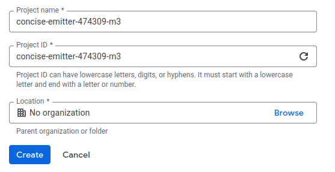

## Project識別子

Google Cloud Projectの識別子は以下の３つがあります


:::: {.no-border-top-table}

|識別子|説明 |形式|事後編集可能性| 重複可能性 |
|-----|----|----|-----------|-----------|
|Project Name|人が読めるプロジェクト名              |alphanumeric |✅|✅|
|Project ID|グローバルに一意のプロジェクト ID        |alphanumeric |❌|❌|
|Project Number|自動生成される一意のプロジェクト識別子|digits       |❌|❌|
: {tbl-colwidths="[20,35,15,15,15]"}
::::

[確認方法]{.mini-section}

```bash
$ gcloud projects list
PROJECT_ID               NAME                    PROJECT_NUMBER
digital-twin-2025        Digital Twin            104567892123
regmonkey-blog           regmonkey-blog          103998721045
test-lab-ml              ML Experiment Sandbox   105432109876
old-project              Old Internal Tool       101234567890
```

[Project IDは公開されるのか？]{.mini-section}

- [Answer]{.regmonkey-bold}
  - プロジェクトや関連するリソースを参照すると，プロジェクト ID とリソース名が公開されます
  - 例: URL(`https://console.cloud.google.com/bigquery?project=regmonkey-blogdata`)

[Projectの削除]{.mini-section}

```bash
$ gcloud projects delete <project ID>
Your project will be deleted.

Do you want to continue (Y/n)?  y

Deleted [https://cloudresourcemanager.googleapis.com/v1/projects/<project ID>].

You can undo this operation for a limited period by running the command below.
    $ gcloud projects undelete <project ID>

See https://cloud.google.com/resource-manager/docs/creating-managing-projects for information on shutting down projects.

```

## Google Cloud Naming Convention
### ❓ 編集ルールFAQ



[Project Name/ID/Numberは設定時に編集可能か？]{.mini-section}

- [Answer]{.regmonkey-bold}: 
  - Project Name: 編集可能
  - Project ID: 編集可能
  - Project Number: 編集不可

[Project Name作成要件]{.mini-section}

- 4~30文字にする必要があり
- 大文字を含めた英数字，シングルクォート，ハイフン，スペース，`!` が使用可能

[Project ID作成要件]{.mini-section}

- 6～30 文字にする必要があり
- 小文字，数字，ハイフンのみ
- 先頭は英文字でなければならない
- 末尾にハイフンは使用できない
- 使用中または以前に使用された ID は指定できない（削除済みのプロジェクトも含む）
- `google` や `ssl` などの制限付き文字列を含めることはできない





### 📘 Tips



::: {.callout-note icon="false"}
### ① Project Nameの可読性

- 誰でも理解できる短く分かりやすい名前
- 個人情報（PII）や機密情報を含めない

:::

::: {.callout-note icon="false"}
### ② Project IDとProject Nameのアライン

- Project IDとProject Nameは異なっていてもよいが，管理容易性の観点からは似たような名前であることが望ましい
- Project IDとProject Name共通の命名規則持つのが良い

参考例として

```ini
{サービス識別子}-{環境識別子(staging / production)}-{企業識別子} 
```
:::

```bash
## simple
$ gcloud projects create scm-staging-regmonkey

## 別にProject Nameをつける場合
$ gcloud projects create scm-staging-regmonkey --name unko
```

と`gcloud`コマンドベースでProjectを作成するとき `create scm-staging-regmonkey` は Project IDとなります．`--name` オプションを利用することでProject Nameも別に指定することができますが，
デフォルトでは Google Project ID = Project Nameという処理が実行されます．

::: {.callout-note icon="false"}
### ③ 環境識別子の明示

- `staging/dev/production`を明示することで，誤操作リスクを減らす

:::

::: {.callout-note}
### ④ インデックスを使う場合はゼロ埋めする

- 数値・インデックスを使う場合はゼロ埋め(`001`, `002`)するとソートしやすくなる

:::


Refereneces
-----------
- [Google Cloud Document > プロジェクトの作成と管理](https://cloud.google.com/resource-manager/docs/creating-managing-projects?hl=ja)
