## 0. Shell Script Setup

```bash
#!/bin/bash
# /opt/myapp/run.sh

set -euo pipefail

exec python3 /opt/myapp/main.py
```


::: {.callout-note}
### `exec` はプロセスの置き換え

shell scriptが子プロセスを起動するとき，bashは生き続けながらforkした子（python3）を管理します．exec を使うと，forkせずにbashプロセス自体がpython3に置き換わります．つまり同じPIDのまま別のプログラムになります



:::

## 1. Unit file の基本構造

```ini
[Unit]
Description=My Application
After=network.target

[Service]
Type=simple
User=myapp
Group=myapp
WorkingDirectory=/opt/myapp
ExecStart=/opt/myapp/run.sh
Restart=on-failure
RestartSec=5s

[Install]
WantedBy=multi-user.target
```

---

### Unit file の配置場所

systemd は決まったディレクトリから unit file を読み込む．用途に応じて配置先を使い分ける．

| パス | 用途 | 優先度 |
|------|------|--------|
| `/etc/systemd/system/` | 管理者が手動で配置するサービス．**通常はここに置く** | 高（パッケージ提供分を上書き可） |
| `/run/systemd/system/` | ランタイム生成された一時的なunit．再起動で消える | 中 |
| `/lib/systemd/system/`（`/usr/lib/systemd/system/`） | パッケージマネージャ（apt等）が配置するサービス．**手で編集しない** | 低 |
| `~/.config/systemd/user/` | ユーザー単位の `systemctl --user` 向け | ― |

優先度が高いパスに同名ファイルがあれば上書きされる．自作サービスは `/etc/systemd/system/myapp.service` に置くのが定石．

```bash
# 配置例
sudo install -m 644 myapp.service /etc/systemd/system/myapp.service
sudo systemctl daemon-reload
```

::: {.callout-tip}
### ファイル名 = サービス名

`/etc/systemd/system/myapp.service` を配置すれば `systemctl start myapp` で起動できる．`.service` 拡張子は省略可能．
:::

---

### repository管理時はsymlinkを使う

unit file をGit repositoryで管理する場合，`/etc/systemd/system/` に**コピー**するのではなく**シンボリックリンク**を張るのが望ましい．

```bash
# repository内の実体
/opt/myapp/deploy/myapp.service

# symlink を作成
sudo ln -s /opt/myapp/deploy/myapp.service /etc/systemd/system/myapp.service
sudo systemctl daemon-reload
```

[メリット]{.mini-section}

- repository側を編集すれば `/etc/systemd/system/` に即反映される．`cp` の再実行や同期忘れが起きない
- `git pull` だけで unit file の更新が完結する
- repositoryが**Single Source of Truth**になり，本番ホスト上で個別に書き換える事故を防げる
- `systemctl cat myapp` でリンク先の実体パスが表示されるので，どのrepositoryのファイルか追跡できる

[注意点]{.mini-section}

- リンク元のファイル・親ディレクトリは `root` から読める権限が必要．`/home/<user>/...` 配下は他ユーザーから見えないことがあるため `/opt/` や `/srv/` 配下を推奨
- `systemctl enable myapp` は `[Install]` セクションを元に `multi-user.target.wants/` 配下に**別のsymlink**を作る．自前のsymlinkと混同しないこと
- リンク元を消すと unit が壊れる．`systemctl disable --now myapp` してから削除する

::: {.callout-warning}
### `daemon-reload` を忘れない

symlink を張り替えた・実体ファイルを編集した直後は `sudo systemctl daemon-reload` が必要．これを忘れると古い定義のまま動き続ける．
:::

---

### `[Service]` フィールド解説

[`Type=simple`]{.mini-section}

プロセスの起動モデルを指定する．

| 値 | 意味 |
|----|------|
| `simple` | `ExecStart` で起動したプロセス自体がメインプロセス．フォアグラウンドで動き続けるデーモンに使う（デフォルト） |
| `forking` | 起動後に親プロセスがforkして終了し，子プロセスがデーモンとして残る旧来スタイル |
| `oneshot` | 一度実行して終了するスクリプト向け．`RemainAfterExit=yes` と組み合わせることが多い |
| `notify` | プロセスが `sd_notify()` で起動完了を通知する．完了通知まで依存サービスの起動を待てる |

shell script を常駐させる場合は `simple` が基本．

---

[`User=myapp` / `Group=myapp`]{.mini-section}

サービスを実行するOSユーザー・グループを指定する．

- 省略すると `root` で実行される（危険なので必ず指定する）
- 専用のシステムユーザーを作成しておくのが定石

```bash
# システムユーザーの作成例
sudo useradd --system --no-create-home --shell /usr/sbin/nologin myapp
```

`--system` はログイン不可のサービス専用ユーザーを作るオプション．

---

[`WorkingDirectory=/opt/myapp`]{.mini-section}

プロセスのカレントディレクトリを指定する．

- 相対パスでファイルを開くスクリプトはここが基点になる
- 省略すると `/` になり，相対パス参照が壊れることがある
- `~` は使えない（`User` のホームディレクトリに展開されない）

---

[`ExecStart=/opt/myapp/run.sh`]{.mini-section}

サービス起動時に実行するコマンドを指定する．

- **絶対パスが必須**（`PATH` は限定的なので `which` で確認すること）
- shell scriptの場合はshebang（`#!/bin/bash`）が必要
- スクリプトに実行権限が必要（`chmod +x run.sh`）

```bash
# よくあるミス：実行権限を忘れる
chmod +x /opt/myapp/run.sh
```

`exec` で子プロセスに置き換えると，PIDがスクリプトではなくアプリ本体になり
systemdのシグナル（`SIGTERM` など）が正しく届く．

```bash
#!/bin/bash
exec python3 /opt/myapp/main.py
```

---

[`Restart=on-failure`]{.mini-section}

プロセスが終了したときの再起動ポリシーを指定する．

| 値 | 再起動するケース |
|----|-----------------|
| `no` | 再起動しない（デフォルト） |
| `on-success` | 正常終了（exit 0）時のみ |
| `on-failure` | 異常終了・シグナル終了時のみ（`systemctl stop` は対象外） |
| `on-abnormal` | シグナル終了・タイムアウト時のみ |
| `always` | `systemctl stop` 以外のすべての終了で再起動 |

本番サービスでは `on-failure` が標準．`always` はデバッグ時に便利だが本番には向かない．

---

[`RestartSec=5s`]{.mini-section}

再起動前の待機時間を指定する．

- デフォルトは `100ms`
- 即時再起動ループを防ぐために数秒設けるのが推奨
- 時間の単位は `s`（秒），`ms`（ミリ秒），`min`（分）など

クラッシュループ防止のために `StartLimitIntervalSec` / `StartLimitBurst` と組み合わせることもある．

```ini
StartLimitIntervalSec=60s
StartLimitBurst=5
# → 60秒以内に5回クラッシュしたらそれ以上再起動しない
```

---

## 2. 登録・管理コマンド

```bash
# unit fileを読み込む（編集後は必ず実行）
sudo systemctl daemon-reload

# 自動起動を有効化 + 即時起動
sudo systemctl enable --now myapp

# 停止
sudo systemctl stop myapp

# 再起動
sudo systemctl restart myapp

# 状態確認
sudo systemctl status myapp

# ログをリアルタイム追跡
journalctl -u myapp -f

# 起動時のログのみ表示
journalctl -u myapp -b
```

---

## 3. 変更時のreload手順

| 変更内容 | 必要な操作 |
|----------|-----------|
| `.service` ファイルを編集 | `daemon-reload` → `restart` |
| `run.sh` を編集 | `restart` のみ |
| 環境変数ファイル（`.env`）を編集 | `restart` のみ |

---

## 4. 環境変数の渡し方

```ini
[Service]
# 直接書く場合
Environment="APP_ENV=production" "PORT=8080"

# ファイルから読む場合
EnvironmentFile=/opt/myapp/.env
```

`.env` ファイルは `KEY=VALUE` 形式で記述する．`export` は不要で `#` コメントが使える．

```bash
# /opt/myapp/.env
APP_ENV=production
PORT=8080
# DATABASE_URL=...
```

## Appendix: 用語解説

:::{.glossary-container}

```yaml
glossary:
  - def: systemd
    description: |
      Linuxの主要なinitシステム兼サービスマネージャ．PID 1 として起動し，
      サービス（unit）の起動順序・依存関係・再起動・ログ収集を一元管理する．
      `systemctl` はその制御CLI．

  - def: unit / unit file
    description: |
      systemd が管理するリソース定義の単位．`.service`（プロセス），
      `.timer`（cron代替），`.socket`（IPC），`.target`（グループ）など
      種類がある．本記事の対象は `.service` unit．

  - def: journalctl
    description: |
      systemd journal を参照するCLI．`-u myapp` で特定サービスのログ，
      `-f` で追跡，`-b` で今回起動分のみ表示．stdout/stderr は自動で
      journalに集約される．

  - def: exec（shellビルトイン）
    description: |
      bash等のshellで，現在のプロセスを別プログラムに**置き換える**組み込み
      コマンド．fork せず同じPIDのまま実行イメージが切り替わる．systemdの
      シグナルがアプリ本体に直接届くようにするため，ラッパー shell script の
      最後で使うのが一般的．
```

:::
