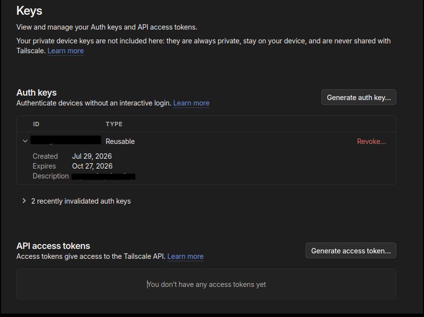
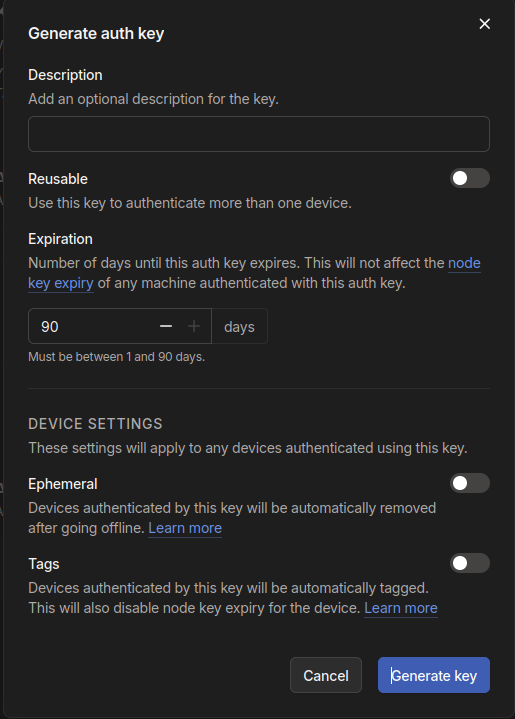
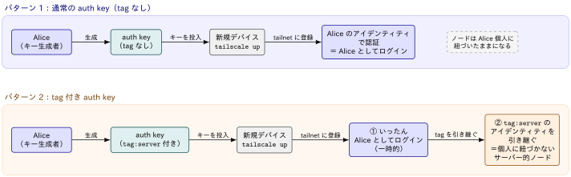

## Auth Keyとは？

::: {#def- .custom_problem .blog-custom-border}
[Pre-authentication keys]{.def-title}

- Auth keyと呼ばれる
- Auth keyを活用することで，ブラウザ経由認証を介さずにTailscaleノードを追加することができる
- 新しいノードは[「キーを生成したユーザー」としてデバイスを認証]{.regmonkey-bold}される
- tag 付きの auth keyの場合は，auth key の tag のアイデンティティを引き継ぐ

:::

[ユースケース]{.mini-section}

- 対話的ログインが困難・非現実的な場面での利用
- コンテナ，IoTデバイスなど

## Auth keyの発行

コンソールから発行する場合は[Tailscale管理画面](https://console.tailscale.com/admin/settings/keys)から
`Generate auth key...` をクリックし，発行する

[Step 1: Tailscale管理画面]{.mini-section}




[Step 2: Generate auth key]{.mini-section}

- フォームで説明（description），reusable か否か，有効期限，デバイス設定を指定
- Ephemeral: デバイスがオフラインになったら自動的に削除する（短命ワークロード向け）

{height=10%}


## 認証の仕組み



[tag付きキーの設定]{.mini-section}

- tag 付き auth key を発行するには，事前に [tailnet policy file（JSON ACL）](https://console.tailscale.com/admin/acls/file)の
`tagOwners` セクションで tag を定義しておく必要あり
- 未定義の tag を指定した auth key は生成できない

```json
{
  "tagOwners": {
    "tag:server":     ["autogroup:admin"],
    "tag:ci-runner":  ["alice@example.com", "tag:server"]
  }
}
```
tag 付きでプロビジョニングされたデバイスは，生成者個人ではなく tag のアイデンティティで動作するため，アクセス範囲は `acls` セクションで
tag を送信元／宛先として明示的に許可しない限り通信できない点に注意してください


[キーの種類]{.mini-section}

:::: {.no-border-top-table}

| 種類	| 説明	| 想定ユースケース|
| --- |  --- | --- |
|One-off（使い捨て） | 1回限りの利用．1台のデバイス／サーバーの接続にのみ使用可能．使用後は Tailscale が自動的に revoke する．| 自分で直接デバイス上の認証操作ができない状況（例：クラウドサーバーの初回接続）|
|Reusable（再利用可能）| 	複数デバイスの接続に繰り返し使用可能．|	オンプレミスDBの複数インスタンスなど，同種ノードの一括接続．|

: {tbl-colwidths="[25,30,45]"}

::::

## 有効期限（Key Expiry）の仕様

:::: {.no-border-top-table}

| 項目 | 説明 |
| --- | --- |
| auth key の有効期限 | 生成時に指定した日数で自動失効．指定可能範囲は 1〜90日．未指定の場合は最大値の 90日 で失効する．失効後も使い続けたい場合は新規キーの生成が必要．|
| 失効後のデバイス | auth key が失効しても，そのキーで認証済みのデバイスは node key が失効するまで認証状態を維持する．|
| node key | 各デバイスは Tailscale ログイン時に node key を生成し，tailnet に対する自己識別に使用する．デフォルトでは 180日 ごとに自動失効．デフォルト値は admin console の Device management > Key Expiry で変更可能．|
| デバイス単位の制御 |admin console の Machines ページ，または Tailscale API の Update device key メソッドで，デバイスごとに key expiry の有効／無効を切り替え可能．|
| tag 付きデバイスの expiry | デフォルトで無効．admin console／CLI／API でデバイスの tag を変更しても，再認証しない限り expiry 設定は変わらない（有効なら有効のまま，無効なら無効のまま）．再認証後は key expiry が無効化される．|
| 失効・revoke 済みキーの確認 | admin console の Keys ページで，最近 revoke されたキー・失効したキーを確認できる．|
: {tbl-colwidths="[30,70]"}

::::

## キーのRevoke(失効)

- revoke できるのは自分自身のキーのみ．
- One-off キーは使用後に Tailscale が自動 revoke
- [キーの revoke は，そのキーで認証済みのノードの認可を取り消さない]{.regmonkey-bold}．ノード自体を無効化するには Machines ページからノードを削除する必要があり


## Appendix: Tailscale API access token との違い

auth key と同じく admin console の Keys ページから発行できるキーとして，Tailscale API 用の access token（API key）があります．
どちらも「Keys ページで発行する有効期限付きのキー」だが，用途が異なります．

:::: {.no-border-top-table}

| 項目 | auth key | API access token |
| --- | --- | --- |
| 用途 | デバイスを tailnet に追加する際の認証（ブラウザ経由認証の代替） | Tailscale API へのリクエスト認証（tailnet 操作の自動化） |
| 発行できる人 | tailnet のユーザー（admin console の Keys ページから） | tailnet の Owner／Admin／IT admin／Network admin のみ |
| 有効期限 | 1〜90日．未指定の場合は最大値の 90日 | 1〜90日．発行時に日数を選択し，経過後に自動失効 |
| 失効時の影響 | キー自体は使えなくなるが，認証済みデバイスは node key が失効するまで認証状態を維持 | API リクエストが認証不能になる．継続利用には新規トークンの発行が必要 |
| revoke | 失効前に revoke 可能．One-off キーは使用後に自動 revoke | 失効前に revoke 可能 |
| 失効・revoke 済みキーの確認 | Keys ページで確認可能 | Keys ページで確認可能 |
| 補足 | tag 付きで発行するとデバイスは tag のアイデンティティを引き継ぐ | 大文字・小文字を区別（case-sensitive）．API 全体へのフルアクセスとなるため，細かい権限制御が必要な場合は trust credentials の利用が推奨される |

: {tbl-colwidths="[20,40,40]"}

::::


References
----------
- [Tailscale Docs › Features › Access control › Auth keys](https://tailscale.com/docs/features/access-control/auth-keys)
- [Tailscale Docs > Technical reference › Tailscale API](https://tailscale.com/docs/reference/tailscale-api)
