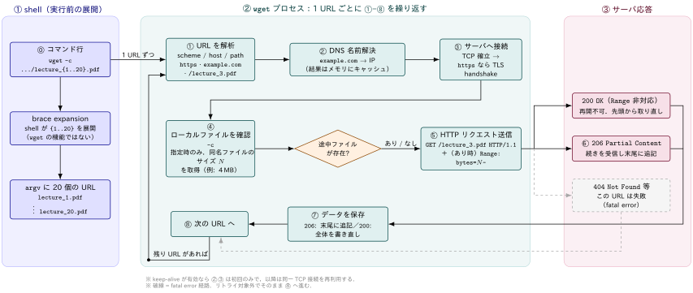

## wget コマンドとは

::: {#def- .custom_problem .blog-custom-border}
[`wget` コマンド]{.def-title}

- 非対話的なネットワークダウンローダ
- HTTP，HTTPS，FTP プロトコルに対応し，HTTP proxy 経由の取得もサポート

:::

[非対話的であることの意味]{.mini-section}

> Wget is non-interactive, meaning that it can work in the background, while the user is not logged on. This allows you to start a retrieval and disconnect from the system, letting Wget finish the work. By contrast, most of the Web browsers require constant user's presence, which can be a great hindrance when transferring a lot of data.

- ユーザがログインしていない状態でもバックグラウンドで動作できる．
  取得を開始してからシステムからログアウトしても，`wget` は動作する
- ブラウザはユーザが常に画面の前にいることを要求し，大量のデータ転送ではそれが大きな障害になるが，
  `wget` はその制約から回避することができる

[主要な機能]{.mini-section}

:::: {.no-border-top-table}

| 機能 | 説明 |
| --- | --- |
| recursive download | HTML / XHTML / CSS 内のリンクを辿り，サイトのディレクトリ構造を再現したローカル版を作る．この際 Robot Exclusion Standard (`/robots.txt`) を尊重する |
| link conversion | ダウンロードしたファイル内のリンクをローカルファイルを指すよう書き換え，オフライン閲覧を可能にする |
| 堅牢性 | 低速・不安定な回線を想定して設計されている．ネットワーク障害で失敗しても，ファイル全体を取得するまでリトライを繰り返す |
| レジューム | サーバが regetting に対応していれば，中断した位置から取得を再開するようサーバに指示する |
: {tbl-colwidths="[30,70]"}

::::

## `wget -c` で lecture note をまとめて取得する


:::: {.callout-note}
### TL;DR

取得したいLecture notesのBase URLが判明している場合，shell の brace expansion と組み合わせて

:::{.code-padding}

```bash
wget -c https://cecilialeiqi.github.io/ds3001/lecture_{1..20}.pdf
```

:::

- `{1..20}` は `wget` の機能ではなく[shell 側]{.regmonkey-bold}の展開
- 実行すると shell が事前に 20 個の URL に展開し，`wget` は複数 URL を
引数として受け取って順番に取得

::::




### `-c` (`--continue`) の役割

- `-c` は部分的にダウンロードされたファイルの取得を継続するオプション
- すでに `lecture_3.pdf` が途中まで存在する場合，`wget` はそれをリモートファイルの
先頭部分とみなし，ローカルファイルの長さに等しいオフセットから取得を再開するよう
サーバに要求する．

:::: {.no-border-top-table}
| ローカルファイルの状態 | `-c` を付けた場合の挙動 |
| --- | ------- |
| 存在しない | 通常どおり最初から取得する |
| サーバ側と同じサイズ | ダウンロードを拒否し，説明メッセージを出す (Wget 1.7 以降) |
| サーバ側より小さい | 差分 `length(remote) - length(local)` バイトだけ取得し，末尾に追記する |
| サーバ側より大きい | 「継続」に意味がないため何もダウンロードしない |
::::

つまり同じコマンドを再実行すれば，[取得済みの回はスキップし，失敗した回だけ取り直す]{.regmonkey-bold}
という使い方ができる．

[`-c` を付けないとどうなるか]{.mini-section}

- `-c` なしで同じディレクトリに再ダウンロードすると，元のファイルは保存されたまま
2 つ目のコピーが `lecture_3.pdf.1` という名前になる．さらに実行すれば `.2`, `.3` と増えていく．
- 中断した `lecture_3.pdf` が残っている状態で `-c` なしに再実行すると，
truncate された `lecture_3.pdf` はそのまま放置され，`lecture_3.pdf.1` に落ちてくる．

### 存在しない番号があるとき

`lecture_20.pdf` まで存在するとは限りません．存在しない番号は 404 になりますが， `connection refused` や `not found` (404) のような fatal error は
リトライ対象外なので，`wget` はその URL を諦めて次の URL へ進みます．20 個中 12 個しかなければ，8 回分の 404 ログが出たうえで 12 個が手に入る．

どの回が取得できなかったかを後から確認したい場合はログを残す．

:::{.code-padding}

```bash
wget -c -o wget.log https://cecilialeiqi.github.io/ds3001/lecture_{1..20}.pdf
grep -E 'ERROR|404' wget.log
```

:::

::: {.callout-note}
### まず `--spider` で存在確認する

- `--spider` を付けると `wget` は Web spider のように振る舞い，ページをダウンロードせず
「そこに存在するか」だけを確認してくれる
- どの番号まで資料があるかを調べるのに使える．

:::{.code-padding}

```bash
$ wget --spider https://cecilialeiqi.github.io/ds3001/lecture_{0..2}.pdf
Spider mode enabled. Check if remote file exists.
--2026-08-06 16:09:53--  https://cecilialeiqi.github.io/ds3001/lecture_0.pdf
Resolving cecilialeiqi.github.io (cecilialeiqi.github.io)... 185.199.109.153, 185.199.108.153, 185.199.110.153, ...
Connecting to cecilialeiqi.github.io (cecilialeiqi.github.io)|185.199.109.153|:443... connected.
HTTP request sent, awaiting response... 404 Not Found
Remote file does not exist -- broken link!!!

Spider mode enabled. Check if remote file exists.
--2026-08-06 16:09:53--  https://cecilialeiqi.github.io/ds3001/lecture_1.pdf
Reusing existing connection to cecilialeiqi.github.io:443.
HTTP request sent, awaiting response... 200 OK
Length: 165939 (162K) [application/pdf]
Remote file exists.

Spider mode enabled. Check if remote file exists.
--2026-08-06 16:09:53--  https://cecilialeiqi.github.io/ds3001/lecture_2.pdf
Reusing existing connection to cecilialeiqi.github.io:443.
HTTP request sent, awaiting response... 200 OK
Length: 217145 (212K) [application/pdf]
Remote file exists.
```
:::


:::

### 保存先を分ける

`-P` (`--directory-prefix`) で保存先ディレクトリを指定できます

:::{.code-padding}

```bash
wget -c -P ./ds3001 https://cecilialeiqi.github.io/ds3001/lecture_{0..2}.pdf
```

:::

### 再ダウンロード制御の他の選択肢

:::: {.no-border-top-table}
| オプション | 意味 |
| --- | --- |
| `-nc` (`--no-clobber`) | 既存ファイルがあればダウンロードしない (`.1` の連番も作らない) |
| `-N` (`--timestamping`) | ローカルとリモートのタイムスタンプ / サイズを比較し，新しければ取得する |
| `--backups=N` | 上書き前に `.1`, `.2` … と世代バックアップを取る |
::::

講義ページを定期的に見に行って「更新された資料だけ落とす」用途では `-N` が便利である．

::: {.callout-note}
### 併用できない組み合わせ

- `-nc` と `-N` は同時に指定できない
- `-N` と `-O` (出力先ファイル指定) は併用できない．`-O` は常にファイルを新規作成するため，
  常に非常に新しいタイムスタンプを持つことになり，タイムスタンプ比較が意味を持たない
- `-nc` と `-O` は，指定した出力ファイルが存在しない場合にのみ受け付けられる
:::

## ネットワークの観点からの注意点

`wget` は簡単に大量のリクエストを生成できるため，相手のサーバや自分の回線に対する
影響を意識して使う必要があります．

### リクエスト頻度を落とす

man page は `-w` の使用を[推奨]{.regmonkey-bold}しており，その理由を
「リクエストの頻度を下げることでサーバ負荷を軽くする」と説明している．

:::: {.no-border-top-table}
| オプション | 意味 |
| --- | -------- |
| `-w seconds` (`--wait`) | 取得ごとに待機する．`m` / `h` / `d` の接尾辞で分・時・日も指定可 |
| `--random-wait` | 待ち時間を `-w` の 0.5〜1.5 倍でランダム化する |
| `--waitretry=seconds` | 失敗時のみ待つ．線形バックオフ (1 回目失敗後 1 秒，2 回目 2 秒…) で指定秒数まで増やす．既定値は 10 秒 |
::::

:::{.code-padding}

```bash
wget -c -w 1 --random-wait https://cecilialeiqi.github.io/ds3001/lecture_{1..20}.pdf
```

:::

- `--random-wait` はもともと，リクエスト間隔の統計的な規則性から `wget` のような
取得プログラムを検出するサイトを想定して追加されたオプションである．

::: {.callout-note}
### ネットワークや宛先ホストが落ちている場合

`-w` に大きな値を指定するのは，ネットワークや宛先ホストがダウンしているときに有効である．
ネットワークエラーが復旧すると期待できる程度に長く待たせることができる．
:::

### タイムアウトを理解する

`wget` のタイムアウトは種類ごとに分かれており，既定で有効なのは read timeout だけ

:::: {.no-border-top-table}
| オプション | 既定値 | 対象 |
| --- | --- | --- |
| `-T seconds` (`--timeout`) | — | 下記 3 つを同時に設定する |
| `--dns-timeout=seconds` | なし (システムライブラリ依存) | DNS 参照 |
| `--connect-timeout=seconds` | なし (システムライブラリ依存) | TCP 接続確立 |
| `--read-timeout=seconds` | 900 秒 | 読み書きの**アイドル時間** |
::::

read timeout は転送全体の時間ではなく[アイドル時間]{.regmonkey-bold}を指す．
ダウンロード中のどこかで指定秒数以上データが届かなければ読み取りが失敗し，
ダウンロードが再開される．このオプションはダウンロード全体の所要時間には直接影響しない．
タイムアウトに `0` を指定すると完全に無効化される．

::: {.callout-important}
### 既定値は基本的に変えない

man page は「何をしているか分かっていない限り，既定のタイムアウト設定は変えないのが最善」
と明記している．

また，リモートサーバがこのオプションの指定より早く接続を切ることは当然ありうる．
:::

### リトライの挙動

:::: {.no-border-top-table}
| オプション | 意味 |
| --- | --- |
| `-t number` (`--tries`) | リトライ回数．既定は 20 回．`0` または `inf` で無限 |
| `--retry-connrefused` | `connection refused` を一時的なエラーとみなして再試行する |
::::

既定では 20 回リトライするが，`connection refused` や `not found` (404) のような
fatal error は[リトライされない]{.regmonkey-bold}．前者は「サーバがそもそも動いていない」
サインであり，リトライしても無意味と解釈されるため

`--retry-connrefused` は，サーバが短時間消えることがある不安定なサイトを
ミラーする場合に使う．

### DNS とアドレスファミリ

:::: {.no-border-top-table}
| オプション | 意味 |
| --- | ------ |
| `--no-dns-cache` | DNS 参照結果のキャッシュを無効化し，接続ごとに名前解決する |
| `-4` / `--inet4-only` | IPv4 ホストにのみ接続する (DNS の AAAA レコードを無視) |
| `-6` / `--inet6-only` | IPv6 ホストにのみ接続する (A レコードを無視) |
| `--prefer-family=none/IPv4/IPv6` | 接続を試すアドレスファミリの順序を変える (アクセス自体は禁止しない) |
| `--bind-address=ADDRESS` | 複数 IP を持つマシンで，接続元アドレスを指定する |
::::

既定では，IPv6 対応の `wget` はホストの DNS レコードが返すアドレスファミリを使う．
IPv4 / IPv6 両方が返った場合は接続できるものが見つかるまで順に試す．
`-4` / `-6` は通常必要にならず，デュアルファミリ環境でのデバッグや
壊れたネットワーク設定への対処に使う．

`--prefer-family` は，IPv4 ネットワークから IPv6 / IPv4 両方に解決されるホストへ
アクセスするときの余計なエラーと接続試行を避けるためのオプションである．
`-4` / `-6` と違ってアドレスファミリへのアクセスを禁止せず，順序だけを変える．
この並べ替えは stable であり，同一ファミリ内の相対順序は保たれる．

::: {.callout-note}
### `--no-dns-cache` の効果範囲

`wget` は既定で参照した IP アドレスを記憶し，同じホストへの取得で DNS サーバへ
繰り返し問い合わせないようにする．このキャッシュはメモリ上にのみ存在し，
新しい `wget` の実行では再度 DNS に問い合わせる．

なお `--no-dns-cache` は，resolver ライブラリや NSCD のような外部キャッシュ層が
行うキャッシュには影響しない．
:::

### keep-alive と proxy

:::: {.no-border-top-table}
| オプション | 意味 |
| --- | ------ |
| `--no-http-keep-alive` | keep-alive を無効化する |
| `--no-proxy` | `*_proxy` 環境変数が設定されていても proxy を使わない |
| `--no-cache` | `Cache-Control: no-cache` と `Pragma: no-cache` を送り，サーバサイドのキャッシュを回避する |
::::

既定では `wget` はサーバに接続を維持するよう要求する．
同じサーバから複数ファイルを取得する場合に同一の TCP 接続で転送されるため，
時間が節約でき，同時にサーバ負荷も下がる．
連番の lecture note を落とす用途はまさにこのケースにあたるので，
通常 keep-alive は有効なままにしておくのが望ましいです．

`--no-http-keep-alive` は，サーバのバグやサーバサイドスクリプトが持続的接続を
扱えない場合の回避策として使う．

### 通信内容を確認する

想定どおりのリクエストが飛んでいるかを確認するためのオプション．

:::: {.no-border-top-table}
| オプション | 意味 |
| --- | ------ |
| `-S` (`--server-response`) | HTTP サーバが送るヘッダ (FTP ではレスポンス) を表示する |
| `-d` (`--debug`) | デバッグ出力．`wget` が debug 付きでビルドされている必要がある |
| `-o logfile` | メッセージをログファイルに書き出す (上書き)．既定では標準エラーへ出力される |
| `-a logfile` | ログファイルに追記する |
| `-nv` (`--no-verbose`) | 完全に黙らせずに verbose を切る．エラーと基本情報は表示される |
| `--show-progress` | `-nv` / `-q` でもプログレスバーを表示する |
| `-b` (`--background`) | 起動直後にバックグラウンドへ移行する．`-o` 未指定なら出力は `wget-log` へリダイレクトされる |
::::

```bash
# ヘッダを見ながら 1 本だけ試す
wget -S --spider https://cecilialeiqi.github.io/ds3001/lecture_1.pdf

# 長時間の取得はバックグラウンドに回す
wget -b -c https://cecilialeiqi.github.io/ds3001/lecture_{1..20}.pdf
```

### 相手サイトのポリシーを尊重する

- `wget` は recursive download の際に Robot Exclusion Standard (`/robots.txt`) を尊重する．
- `--password` や URL 内にパスワードを直接書くと，`ps` を実行した他ユーザから見えてしまうので，`--ask-password` で対話的に入力する，`--use-askpass` を使う，あるいは
`.wgetrc` / `.netrc` に保存して `chmod` で保護する．


## Appendix: Glossary of Terms

:::{.glossary-container}

```yaml
glossary:
  - def: brace expansion (`{1..20}`)
    description: |
      shell が波括弧内の範囲を複数の文字列に展開する機能．`wget` の機能ではないため，
      `wget` からは複数の URL が引数として渡されたようにしか見えない．
      展開結果は `echo` で事前に確認できる．

  - def: recursive download (`-r`)
    description: |
      取得した HTML/XHTML/CSS 内のリンクを辿って，リンク先のファイルも
      連鎖的にダウンロードする機能．サイトのディレクトリ構造をローカルに
      再現したミラーを作ることができる．再帰時は robots.txt が尊重される．

  - def: Robot Exclusion Standard (`robots.txt`)
    description: |
      サイト側がクローラに対して「どのパスを取得してよいか」を宣言する仕組み．
      `wget` は再帰取得の際にこれを尊重する．

  - def: regetting / `Range` ヘッダ
    description: |
      HTTP でファイルの一部分 (バイト範囲) を要求するためのヘッダ．
      `wget -c` によるレジューム (中断したダウンロードの再開) は，
      FTP サーバ，または `Range` に対応した HTTP サーバでのみ機能する．
      非対応のサーバでは最初から取り直しになり，既存ファイルは上書きされる．

  - def: read timeout (`--read-timeout`)
    description: |
      転送全体の時間ではなく「アイドル時間」に対するタイムアウト．
      ダウンロード中のどこかで指定秒数以上データが届かない場合に読み取りが失敗し，
      ダウンロードが再開される．既定値は 900 秒で，`wget` で既定有効な
      唯一のタイムアウトである．

  - def: fatal error
    description: |
      `connection refused` や `not found` (404) のように，リトライしても
      無意味と判断されるエラー．`-t` で指定したリトライ回数の対象外となる．
      `--retry-connrefused` を付けると `connection refused` は一時的エラーとして
      再試行されるようになる．

  - def: boolean option (真偽値オプション)
    description: |
      `--follow-ftp` のような肯定形と `--no-glob` のような否定形を持つオプション．
      肯定形は `--no-` を前置して否定でき，否定形は `--no-` を外して肯定できる．
      `.wgetrc` で既定値が変えられている場合，コマンドラインから工場出荷時の
      挙動へ戻す手段になる．

  - def: keep-alive
    description: |
      同一サーバへの複数リクエストを 1 本の TCP 接続で転送する HTTP の仕組み．
      `wget` は既定で接続維持を要求する．時間を節約すると同時にサーバ負荷も下げる．
      サーバのバグ等で問題が起きる場合のみ `--no-http-keep-alive` で無効化する．

  - def: `.wgetrc`
    description: |
      `wget` の起動時設定ファイル．`-e command` でコマンドラインから
      `.wgetrc` の設定を追記的に上書きできる (`.wgetrc` 内の設定より優先される)．
      `--config=FILE` で別のファイルを指定，`--no-config` で読み込みを無効化する．
```

:::

References
----------
- [wget vs curl](../2025-02-07-wget-vs-curl/index.qmd)
