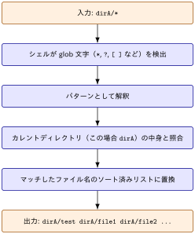

## Problem

カレントディレクトリ以下に `dirA/` というサブディレクトリが以下のような構成で存在するとする

```zsh
% tree dirA -a
dirA
├── .config
├── .test
│   ├── .test2.txt
│   └── test.txt
└── test
    ├── .test2.txt
    └── test.txt

3 directories, 5 files

```

この `dirA/` を `dirB/` にまるっとコピーしようと思い，アーカイブモードoptionを利用して

```zsh
% mkdir dirB
% cp -a dirA/* dirB
```

と実行したところ

```zsh
% tree -a dirB
dirB
└── test
    ├── .test2.txt
    └── test.txt

2 directories, 2 files

```

となり，一部の隠しファイル及び隠しディレクトリがコピーされなかった．

## Glob Matchingの挙動

::: {.callout-note}
### TL;DRs

|シェル|デフォルト挙動を制御するオプション|有効にすると隠しファイルもマッチ|
| ------ | ---------------- | ---------------- |
|bash|`dotglob`（デフォルトoff）|`shopt -s dotglob`|
|zsh|`GLOB_DOTS`（デフォルトoff）|`setopt GLOB_DOTS` または glob修飾子 `(D)`|

:::

`*`，`?`などのワイルドカードを使ったファイルパスは glob パターン と呼ばれます．[GNU Bash Manual, 3.5.8 Filename Expansion](https://www.gnu.org/software/bash/manual/html_node/Filename-Expansion.html)において以下のように説明されています．

> Bash scans each word for the characters ‘*’, ‘?’, and ‘[’. If one of these characters appears, and is not quoted, then the word is regarded as a pattern, and replaced with a sorted list of filenames matching the pattern

`*`，`?`などのワイルドカードを用いた文字列はパターンとみなされ，そのパターンにマッチするファイルネームリストとして展開される(原文ではreplaced with a sorted list) = globbing 処理がなされるということです．

::: {#exm- .custom_problem }
[`echo dirA/*` の処理の流れ]{.def-title}

:::: {.columns}
::: {.column width="60%"}



:::
::: {.column width="40%"}

- コマンド（`cp` や `echo` など）が実行される前にシェル自身が行う
- `cp` や `echo `コマンド自身はglob pattern自体は知らず，シェルによってすでに展開済みの具体的なファイル名リストを受け取っている

:::
::::


:::
***

### 隠しファイルとGlobbing in Bash

[GNU Bash Manual, 3.5.8 Filename Expansion](https://www.gnu.org/software/bash/manual/html_node/Filename-Expansion.html)において

> When a pattern is used for filename expansion, the character ‘.’ at the start of a filename or immediately following a slash must be matched explicitly, unless the shell option dotglob is set.

`dotglob` を有効にしない限り，明示的に指定しないと `dirA/.config` などの隠しファイルや隠しディレクトリはglobbingされないと明言されています．

::: {#exm- .custom_problem }
[dotglob有効化]{.def-title}

:::: {.columns}
::: {.column width="50%" }

```bash
$ echo dirA/*
dirA/test
```

- `dirA` 直下の `.` で始まるものは除外

:::
::: {.column width="50%" .padding-left-10}

```bash
$ shopt -s dotglob # 有効化

$ echo dirA/*
dirA/.config dirA/.test dirA/test

$ shopt -u dotglob # 無効化
```

- `.`, `..` というエントリは有効化してもマッチングしない

:::
::::


:::
***

### 隠しファイルとGlobbing in Zsh

[The Z Shell Manual > Expansion](https://zsh.sourceforge.io/Doc/Release/Expansion.html?#Glob-Qualifiers) において


> Other characters which must match exactly are initial dots in filenames (unless the GLOB_DOTS option is set)

と記載があるように，Bash と同様に明示的に指定しないと `dirA/.config` などの隠しファイルや隠しディレクトリはglobbingされません．

[`setopt GLOB_DOTS` の設定]{.mini-section}

```zsh
% setopt GLOB_DOTS      # 有効化
% unsetopt GLOB_DOTS    # 無効化
```

と `GLOB_DOTS` を切り替えることができます．現在の設定状態を確認する方法は

```zsh
% setopt | grep -i globdots
globdots
```

有効化したあとでは，`.` から始まるファイルやディレクトリも以下のようにマッチします

```zsh
% echo dirA/*
dirA/.config dirA/.test dirA/test

```

[`(D)` qualifierの活用]{.mini-section}

[The Z Shell Manual > Expansion](https://zsh.sourceforge.io/Doc/Release/Expansion.html?#Glob-Qualifiers) を読んでみると

> D: sets the GLOB_DOTS option for the current pattern 

との記載があります．

`(D)` は zsh 固有の glob qualifier で，`setopt GLOB_DOTS` のようにシェル全体のオプションを変更することなく，[そのパターン1回限定]{.regmonkey-bold}で隠しファイルを対象に含めることができます

```zsh
% echo dirA/*(D)      # (D)修飾子でこのパターンだけ隠しファイルも対象に
dirA/.config dirA/.test dirA/test
```

`setopt GLOB_DOTS` / `unsetopt GLOB_DOTS` のように前後でオプションを切り替える必要がない点がメリットです．`cp -a` と組み合わせるなら次のように書けます．

```zsh
cp -a dirA/*(D) dirB
```

Then,

```zsh
% tree -a dirB
dirB
├── .config
├── .test
│   ├── .test2.txt
│   └── test.txt
└── test
    ├── .test2.txt
    └── test.txt

3 directories, 5 files

```

## Globbingを用いない解決策

[Solution 1]{.mini-section}

Bash, ZshそれぞれのGlobbing挙動について上記では説明しましたが，もともとやりたかったことは[ `dirA` の中身をまるっと，`dirB` へコピーする]{.regmonkey-bold}です

この場合，

```zsh
cp -a dirA/. dirB
```

で十分です．「`.`」 は「そのディレクトリ自身」を指す特殊なパスでglob特殊文字ではないので，ドットファイルが除外されるなどの副作用は発生しません．

[Solution 2]{.mini-section}

`rsync` コマンドを用いて

```zsh
rsync -az dirA/ dirB
```

`dirA` の中身をまるっと `dirB` へ動悸されることができます．


::: {.callout-caution}
### slashを忘れるな

`dirA/` でなく `dirA` と指定してしまうと，`dirA` というディレクトリ自体が `dirB` の[中にコピー]{.regmonkey-bold}されてしまいます．


```zsh
% rsync -a dirA dirB
% tree -a dirB        
dirB
└── dirA
    ├── .config
    ├── .test
    │   ├── .test2.txt
    │   └── test.txt
    └── test
        ├── .test2.txt
        └── test.txt

```


:::


## Glossaries

:::{.glossary-container}

```yaml
glossary:
  - def: glob
    description: |
      シェルにおいて `*` や `?` などのワイルドカード文字を使ってファイル名のパターンを
      表現し，そのパターンにマッチするファイル・ディレクトリの一覧に展開する機能．
      例えば `*.txt` はカレントディレクトリ内の拡張子が `.txt` であるすべてのファイルに
      展開される．

  - def: qualifier（修飾子）
    description: |
      zsh の glob 展開において，パターンの末尾に丸カッコ `(...)` で付与する修飾子．
      展開結果をファイルの種類（ディレクトリ・シンボリックリンク等），更新日時，
      サイズなどの条件でさらに絞り込んだり，ソート順を指定したりするために使う．
      例えば `*(.)` は通常ファイルのみに，`*(/)` はディレクトリのみに絞り込む．

  - def: rsync
    description: |
      ローカル・リモート間でファイルやディレクトリを効率的に同期するコマンド．
      差分ファイルのみを転送するため大量のデータコピーより高速．
      ネットワーク越しの通信でも，転送時に圧縮(-z)の設定が可能．
  
```

:::

References
---------
- [zsh manual > Glob Qualifiers](https://zsh.sourceforge.io/Doc/Release/Expansion.html?#Glob-Qualifiers)
